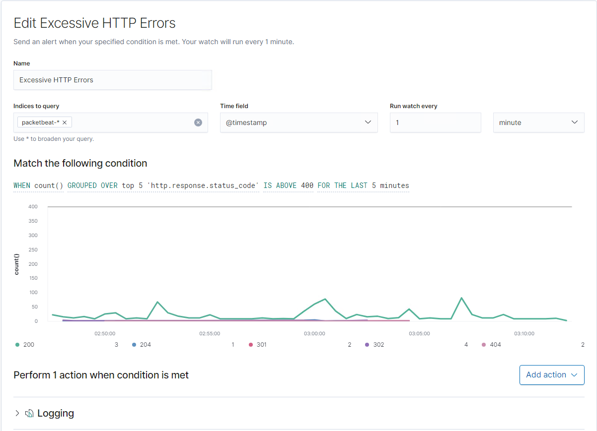
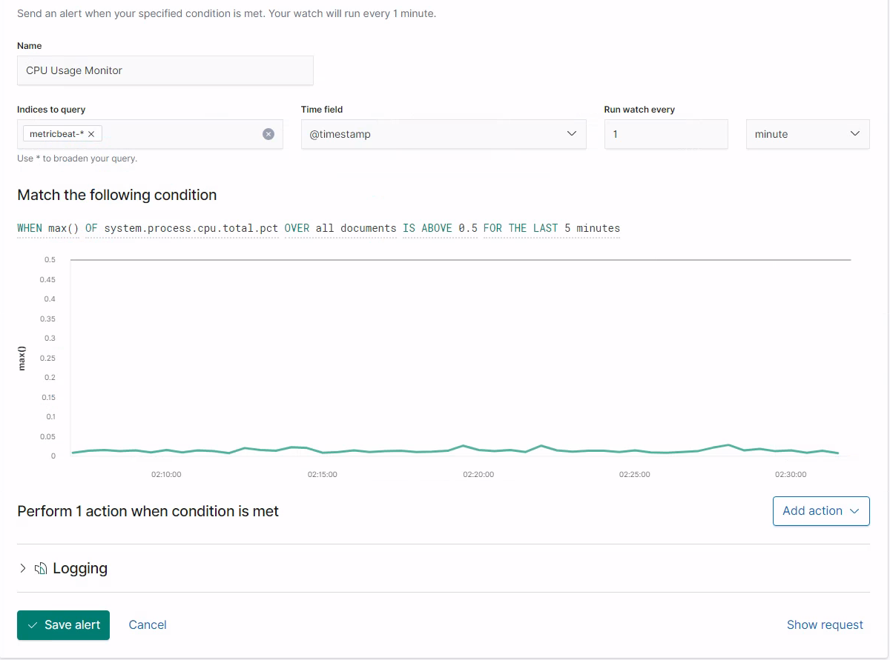
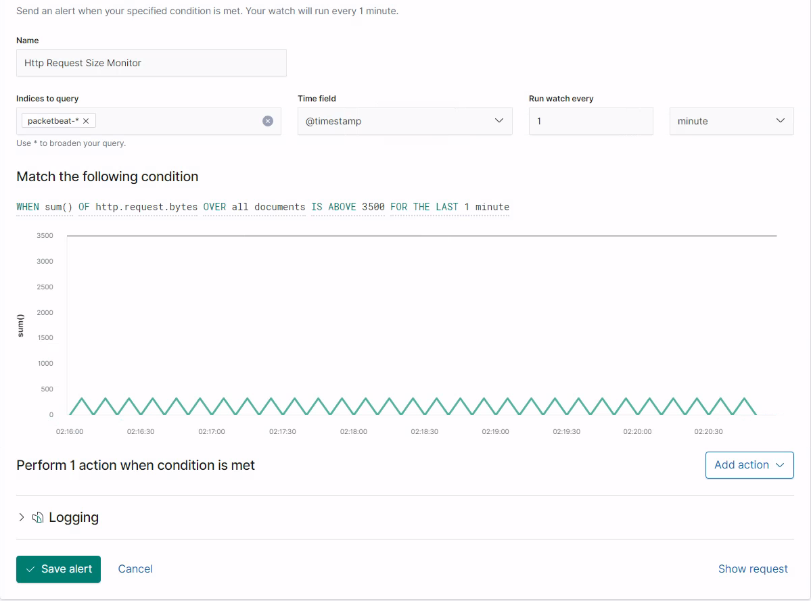

# Blue Team: Summary of Operations

## Table of Contents
- Network Topology
- Description of Targets
- Monitoring the Targets
- Patterns of Traffic & Behavior
- Suggestions for Going Further

### Network Topology
_TODO: Fill out the information below._

The following machines were identified on the network:
- Name of VM 1 _Kali_
  - **Operating System**: _Linux 5.4.0_
  - **Purpose**: _Attacking machine_
  - **IP Address**: _192.168.1.90_
- Name of VM 2 _Capstone_
  - **Operating System**: _Linux (Ubuntu 18.04.1 LTS)_
  - **Purpose**: _Used as a testing system for alerts_
  - **IP Address**: _192.168.1.105_
- Name of VM 3 _ELK_
  - **Operating System**: _Linux (Ubuntu 18.04.1 LTS)_
  - **Purpose**: _Used for gathering information from the victim machine using Metricbeat, Filebeat, and Packetbeat_
  - **IP Address**: _192.168.1.100_
- Name of VM 4 _Target 1_
  - **Operating System**: _Linux 3.2 - 4.9_
  - **Purpose**: _The VM with WP as a vulnerable server_
  - **IP Address**: _192.168.1.110_
- Name of VM 5 _Target 2_
  - **Operating System**: _Linux 3.2 - 4.9_
  - **Purpose**: _The VM with WP as a vulnerable server_
  - **IP Address**: _192.168.1.115_
- Name of VM 6 _Hyper V Manager_
  - **Operating System**: _Windows 10_
  - **Purpose**: _Contains all VM's (attacking machine, vulnerable VM's)_
  - **IP Address**: _192.168.1.1_

### Description of Targets

The target of this attack was: `Target 1` (192.168.1.110).

`Target 1` is an Apache web server and has SSH enabled, so ports 80 and 22 are possible ports of entry for attackers. As such, the following alerts have been implemented:

### Monitoring the Targets

Traffic to these services should be carefully monitored. To this end, we have implemented the alerts below:

#### Name of Alert 1
_Excessive HTTP Errors_

Alert 1 is implemented as follows:
  - **Metric**: _Packetbeat: http.response.status_code > 400_
  - **Threshold**: _Grouped http response status codes above 400 every 5 minutes._
    - _WHEN count() GROUPED OVER top 5 'http.response.status_code' IS ABOVE 400 FOR THE LAST 5 minutes_
  - **Vulnerability Mitigated**: 
    - _Used instrusion detection/prevention for attacks._
    - _IPS would block any suspicious IP's._
    - _Filter and disable or close port 22._
    - _Use account management to lock user accounts or make it to where passwords are changed every 30,60, or 90 days._
  - **Reliability**: Does this alert generate lots of false positives/false negatives? Rate as low, medium, or high reliability.
    - _The alert will not generate an excessive amount of false positives._
    - _Medium Reliability._

    

#### Name of Alert 2
_CPU Usage Monitor_

Alert 2 is implemented as follows:
  - **Metric**: _Metricbeat: system.process.cpu.total.pct_
  - **Threshold**: _Maximum cpu total percentage is over .5 in 5 minutes_
    - _WHEN max() OF system.process.cpu.total.pct OVER all documents IS ABOVE 0.5 FOR THE LAST 5 minutes_
  - **Vulnerability Mitigated**: _Control the CPU usage percent at 50%, this will trigger a memory alert only if the CPU remains or goes above 50% for 5 minutes consistenly. Virus and/or Malware._
  - **Reliability**: Does this alert generate lots of false positives/false negatives? Rate as low, medium, or high reliability.
    - _Yes. The alert can generate a lot of false positives due to CPU spikes happening when specific parts of the integrations are initiated at the start of processing._
    - _High Reliability._

    

#### Name of Alert 3
_HTTP Request Size Monitor_

Alert 3 is implemented as follows:
  - **Metric**: _Packetbeat: http.request.bytes_
  - **Threshold**: _Sum of the requested bytes is over 3500 in 60 seconds._
    - _WHEN sum() of http.request.bytes OVER all documents IS ABOVE 3500 FOR THE LAST 1 minute_
  - **Vulnerability Mitigated**: _Controlling the number of http requests through a filter, protection is enabled to detect or prevent DDoS attacks for IPS/IDS._
  - **Reliability**: Does this alert generate lots of false positives/false negatives? Rate as low, medium, or high reliability.
    - _No, this alert does not generate an excessive amount of false positives, DDoS attacks submit requests within seconds and not within minutes._
    - _Medium Reliability._

    
