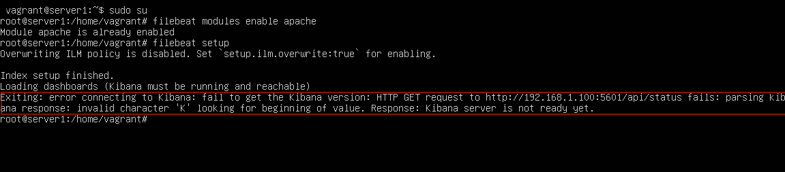

## Unit 24: Final Project README

### Unit Description

In this project, you will act as a security engineer supporting an organization's SOC infrastructure. The SOC analysts have noticed some discrepancies with alerting in the Kibana system and the manager has asked the security engineering team to investigate and confirm that newly created alerts are working. 

If the alerts are working, you will then monitor live traffic on the wire to detect any abnormalities that aren't reflected in the alerting system. Then, you will report back your findings to the manager with appropriate analysis.

### Unit Objectives 

    
Click here to view the daily unit objectives.

   

- **Days 1 and 2:** Alert and Attacking Target 1

    - Configure alerts in Kibana 
    - Attack a machine on the network.
    - Capture the flag on the victim machine.

- **Day 3:** Wireshark Strikes Back

    - Capture network traffic
    - Investigate a number of suspicious activities
    - Collect corporate misuse evidence
    - Work in groups to create a presentation

- **Day 4:** Final Group Presentations

    - Complete and submit group presentations
    - Submit an offensive red team analysis
    - Submit a defensive blue team analysis
    - Submit a network forensic analysis. 

### Lab Environment

Lab Details

 

In this unit, you will be using a new Web Vulns lab environment located in Windows Azure Lab Services. RDP into the **Windows RDP host machine** using the following credentials:

  - Username: `azadmin`
  - Password: `p4ssw0rd*`

This is a diagram of the network and the machines that will be used in this lab:

Open the Hyper-V Manager to access the nested machines:

**ELK machine credentials:** The same ELK setup that you created in Project 1. It holds the Kibana dashboards.
- Username: `vagrant`
- Password: `vagrant`
- IP Address: `192.168.1.100`

**Kali:** A standard Kali Linux machine for use in the penetration test on Day 1. 
- Username: `root`
- Password: `toor`
- IP Address: `192.168.1.90`

**Capstone:** Filebeat and Metricbeat are installed and will forward logs to the ELK machine. 
- IP Address: `192.168.1.105`
   - Please note that this VM is in the network solely for the purpose of testing alerts.

**Target 1:** Exposes a vulnerable WordPress server.
- IP Address: `192.168.1.110`

**Target 2:** Students should ignore Target 2 until they have completed all other parts of the project.

  

### What to Be Aware Of:

It is common to encounter to experience the following issue:

* If students encounter this error, explain that Kibana needs time to finish setting up. They should wait five to ten minutes and then try again. 

* If the issue is still not resolved, ask to students to log into the ELK machine using the machines credentials and run the following commands:

    - `sudo su` which will allow the student to become the root user. 
    - `docker container ls` to find the name of the running docker container. 
    - `docker container stop <container-name>` which will stop the docker container.
    - `docker container start <container-name>` which will start the docker container back up.

* When setting alerts in Kibana to send log messages, those messages will not show in Kibana without additional configuration. Instead, the status of alerts can be viewed from the 'Watcher' page where the alerts are created.

### Security+ Domains

This unit covers portions of the following domains on the Security+ exam:

- 1.0 Attacks, Threats, and Vulnerabilities 
- 2.0 Architecture and Design 
- 3.0 Implementation
- 4.0 Operations and Incident Response 

For more information about these Security+ domains, refer to the following resource: [Security+ Exam Objectives](https://comptiacdn.azureedge.net/webcontent/docs/default-source/exam-objectives/comptia-security-sy0-601-exam-objectives-(2-0).pdf?sfvrsn=8c5889ff_2)

### Additional Reading and Resources

 

 Click here to view additional reading materials and resources. 

 

These resources are provided as optional, recommended resources to supplement the concepts covered in this unit.

- [SANS Pentesting Cheatsheet](https://www.sans.org/blog/sans-poster-building-a-better-pen-tester-pdf-download/)

---

© 2020 Trilogy Education Services, a 2U, Inc. brand. All Rights Reserved.    
