## Week 16 Homework Submission File: Penetration Testing 1

#### Step 1: Google Dorking


- Using Google, can you identify who the Chief Executive Officer of Altoro Mutual is:
  - _Found the information on `http://www.altoromutual.com/index.jsp?content=inside_executives.htm` or `demo.tesfire.net --> About Us --> Executives & Management Team`_

    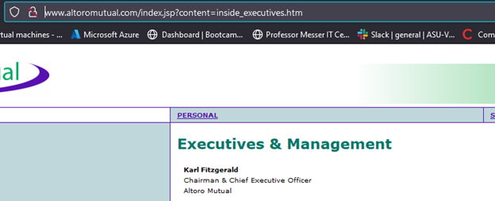

- How can this information be helpful to an attacker:
  - _This information is very useful to an attacker who wants to send phishing emails directly to the C-Suite members._

#### Step 2: DNS and Domain Discovery

Enter the IP address for `demo.testfire.net` into Domain Dossier and answer the following questions based on the results:

  1. Where is the company located: 
    - _Sunnyvale, CA 94085_

  2. What is the NetRange IP address:
    - _65.61.137.64 - 65.61.137.127_

  3. What is the company they use to store their infrastructure:
    
    ```
    CustName:       Rackspace Backbone Engineering
    Address:        9725 Datapoint Drive, Suite 100
    City:           San Antonio
    StateProv:      TX
    PostalCode:     78229
    Country:        US
    RegDate:        2015-06-08
    Updated:        2015-06-08
    Ref:            https://rdap.arin.net/registry/entity/C05762718
    ```
    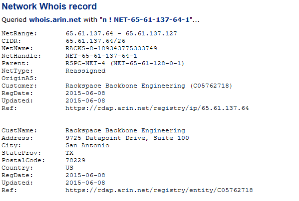


  4. What is the IP address of the DNS server:
    - _65.61.137.117_

    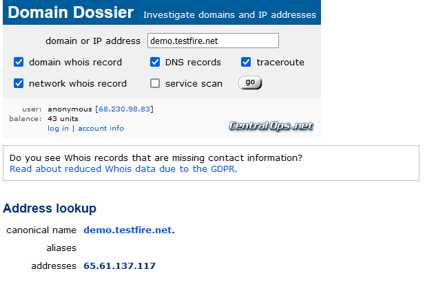

#### Step 3: Shodan

- What open ports and running services did Shodan find:
  - _Found at `https://www.shodan.io/host/65.61.137.117`_
    - _Port(s) 80, 443, 8080_

  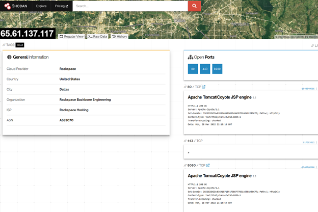

#### Step 4: Recon-ng

- Install the Recon module `xssed`. 
  - _Search by using `marketplace search xssed`_
  - _Install by using `marketplace install recon/domains-vulnerabilities/xssed`_
  - _Load by using `modules load recon/domains-vulnerabilities/xssed`_

  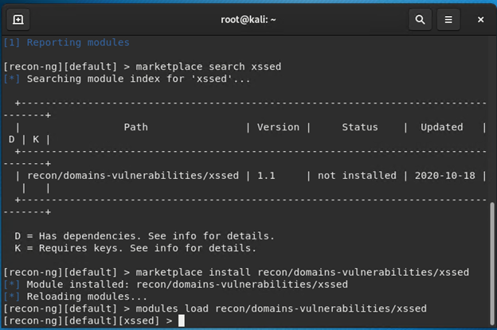

- Set the source to `demo.testfire.net`. 
  - _Check details of module by using `info`_
  - _Change source to `demo.testfire.net` using `options set SOURCE demo.testfire.net`_

  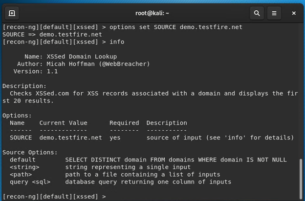

- Run the module.
  - _Run the module using `run`_

  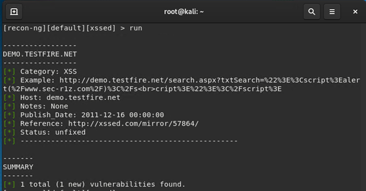

Is Altoro Mutual vulnerable to XSS: 
  - _Yes it was the only vulnerability found._
  - _Entering `<script>alert("You have been hacked!")</script>` inside the search bar shows the vulnerability._

  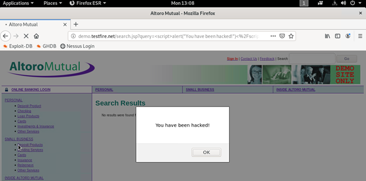

### Step 5: Zenmap

Your client has asked that you help identify any vulnerabilities with their file-sharing server. Using the Metasploitable machine to act as your client's server, complete the following:

- Command for Zenmap to run a service scan against the Metasploitable machine: 
  - _From the Hyper-V manager launch the `kali` machine_
  - _Start the terminal and enter `zenmap` press enter_
  - _The machine IP for Metasploitable is `192.168.0.10`_
  - _Inside zenmap set Target as `192.168.0.10`_
  - _Set profile as `quick scan`._
  - _The nmap command is `nmap -T4 -F 192.168.0.10`_
  - _Click scan results._
 
  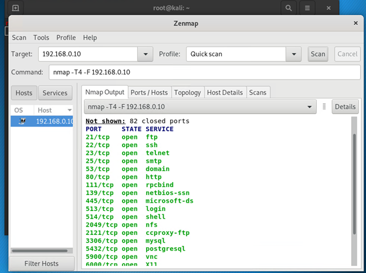

- Bonus command to output results into a new text file named `zenmapscan.txt`:
  - _To save the results in the `zenmapscan.txt` file add the following to the command `-oN zenmapscan.txt`._
  - _It should look like the below:_
    - `nmap -T4 -F -oN zenmapscan.txt 192.168.0.10`

- Zenmap vulnerability script command: 

- Once you have identified this vulnerability, answer the following questions for your client:
  - _There are two scripts that can be selected under the Profiles tab._
  - _These are `ftp-vsftpd-backdoor` and `smb_enum_shares`_

  - _The command should look like the following:_
    - ` nmap -T4 -F --script ftp-vsftpd-backdoor,smb-enum-shares 192.168.0.10`

  1. What is the vulnerability:
    - _The vulnerability is shown below._

    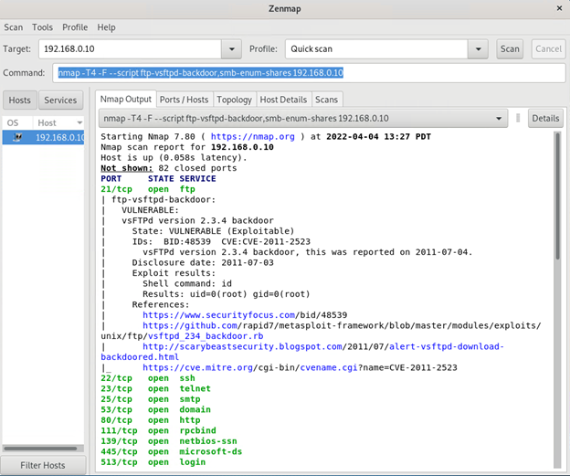

    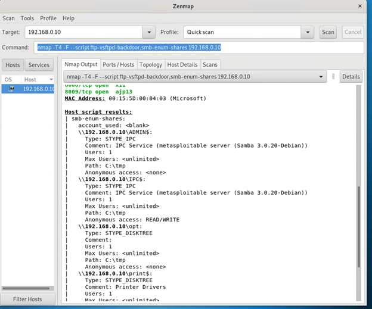
  
  2. Why is it dangerous:
    - _This is dangerous due to the `VSFTPD 2.3.4` backdoor attack can be applied on port 21 via a malicious code, if this is succcesfully done this can open the backdoor on port 6200._
    - _The `SMB` can get access through an organizations networks._
      - _SMB vulnerabilites allow the payload to spread through any connected systems._

  3. What mitigation strategies can you recommendations for the client to protect their server:
    - _The vsFPTD 2.3.4 patch was released on July 3, 2011 with the patch constantly monitered and updated._
      - _The vsFTPD v2.3.4 backdoor reported on `2011-07-04(CVE-2011-2523)`._
    - _SMB (CVE-2017-0145) was released by Microsoft(MS17-010) and the SAMBA(CVE-2017-0145) patches were released by RHL (RHSA-2017:1390)_


##### References
- [CVE-2011-2523](https://nvd.nist.gov/vuln/detail/CVE-2011-2523)
- [CVE-2017-7494](https://access.redhat.com/security/cve/cve-2017-7494)

---
© 2020 Trilogy Education Services, a 2U, Inc. brand. All Rights Reserved.  

