## Solution Guide: Part 1 - Master of the SOC

### Windows Server Logs

**Reports**: Design the following reports to assist VSI with quickly identifying specific information.
 1. A report with a table of signatures with associated SignatureID.
      
   	- `source="windows_server_logs.csv"  | table signature signature_id | dedup signature`
	
  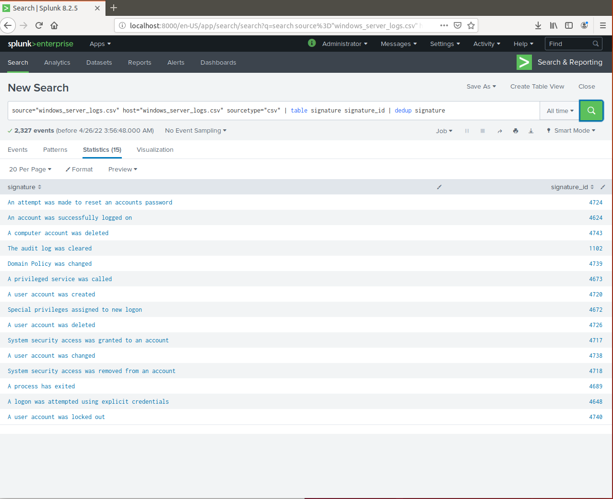
  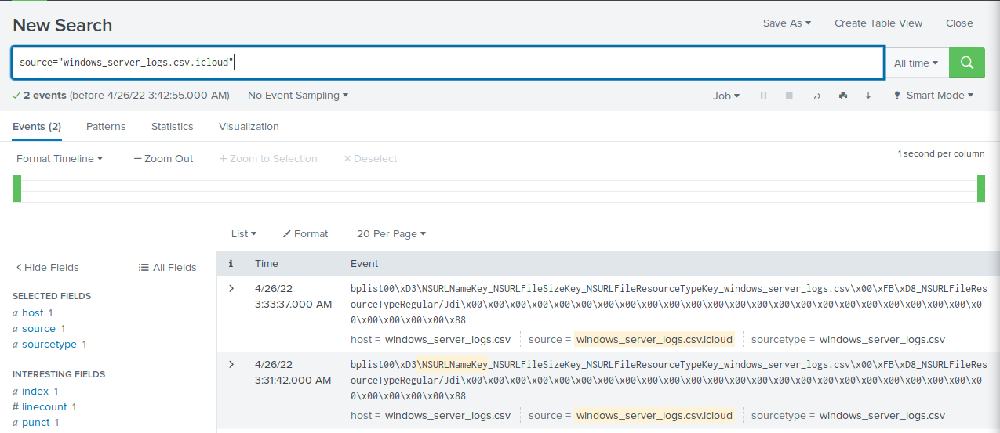

2. A report that provides the count and percent of the severity.

	- `source="windows_server_logs.csv" |  top severity`

    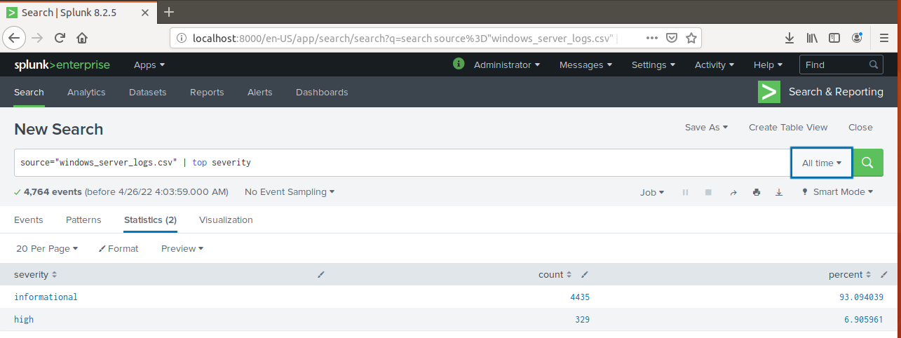
    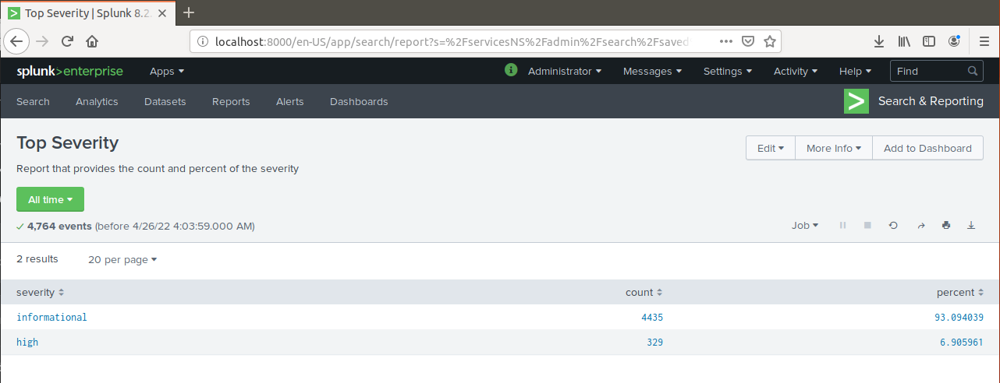
	
3. A report that provides a comparison between the success and failure of Windows activities.

	- `source="windows_server_logs.csv" | top  status`
	
    
    

**Alerts**: Design the following alerts to notify VSI of suspicious activity.

1. Determine an appropriate baseline and threshold for hourly level of failed Windows activity. Create an alert to trigger when the threshold has been reached. The alert should trigger an email to SOC@VSI-company.com.
       
	- `source="windows_server_logs.csv"  status=failure `

    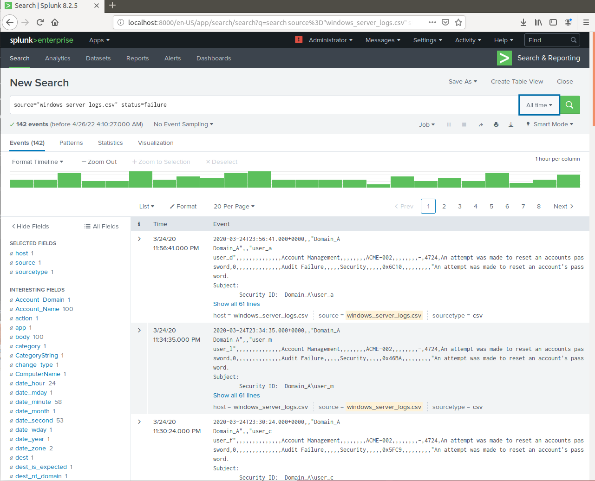
    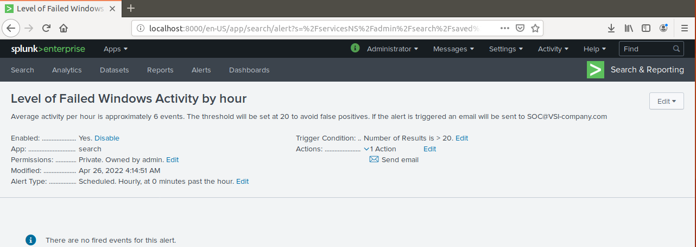
	
	- The average activity per hour is approximately six events. Therefore the threshold is set at 20 to avoid false positives.

	- To create alert, change the search to one hour and click

		- Set to run every hour.

		- Set alert to trigger when count is greater than chosen threshold of (20).

		- Add action **Send email** to SOC@VSI-company.com.
	
          
2. Determine a baseline and threshold for hourly count of the signature **an account was successfully logged on**. Create an alert to trigger when the threshold has been reached. The alert should trigger an email to SOC@VSI-company.com.

	- `source="windows_server_logs.csv" signature="An account was successfully logged on"`

    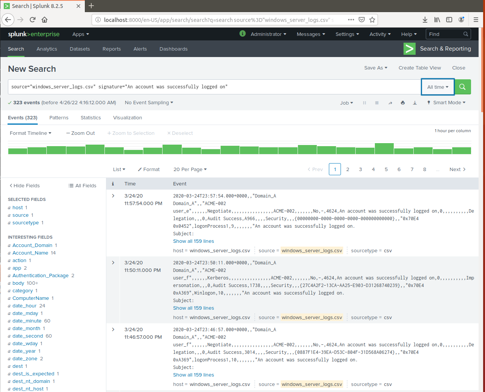
    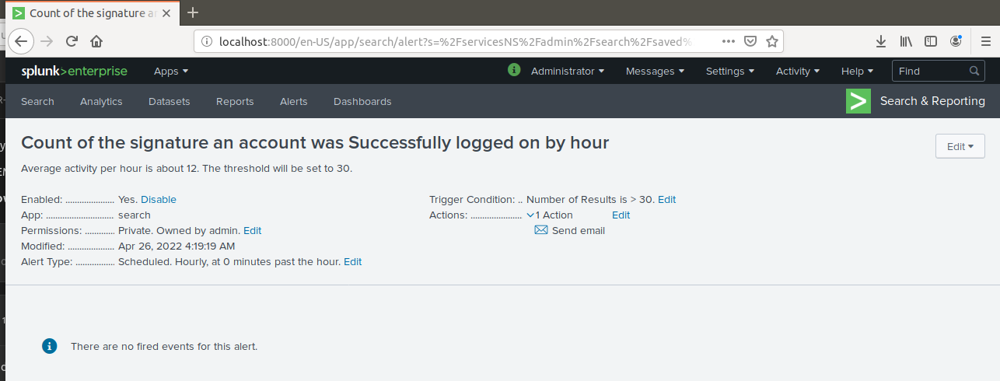
    
	- The average activity per hour is approximately 12 events. Therefore the threshold is set at 30.

	- To create alert, change the search to one hour
	
	    - Set to run every hour.

	    - Set alert to trigger when count is greater than chosen threshold of (30).

	    - Add action **Send email** to SOC@VSI-company.com.
          
                  
3. Determine a baseline and threshold for hourly count of the signature **a user account was deleted**. Design the alert based on the corresponding SignatureID. Create an alert to trigger when the threshold has been reached. The alert should trigger an email to SOC@VSI-company.com.   
		
	- `source="windows_server_logs.csv" signature_id=4726`

    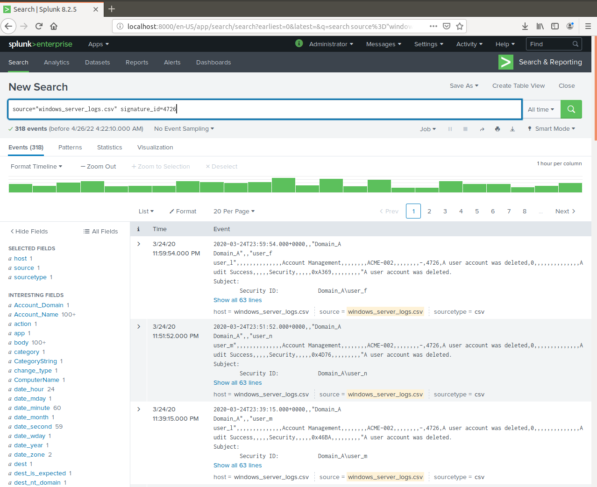
    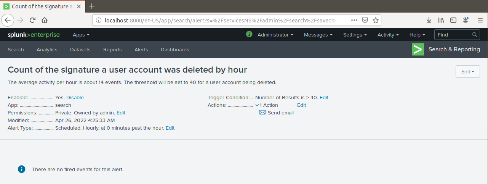

	- The average activity per hour is approximately 13 events.

	- The threshold range should be between 30-50.

	- To create alert, change the search to one hour
	
	    - Set to run every hour.

	    - Set alert to trigger when count is greater than chosen threshold of (30).

	    - Add action **Send email** to SOC@VSI-company.com.
                  
                   
**Visualizations and Dashboards**: Design the following visualizations and add them to a dashboard called Windows Server Monitoring:

1. A line chart that displays the different `signature` field values over time.

	- `source="windows_server_logs.csv" | timechart span=1h count by signature`

    
	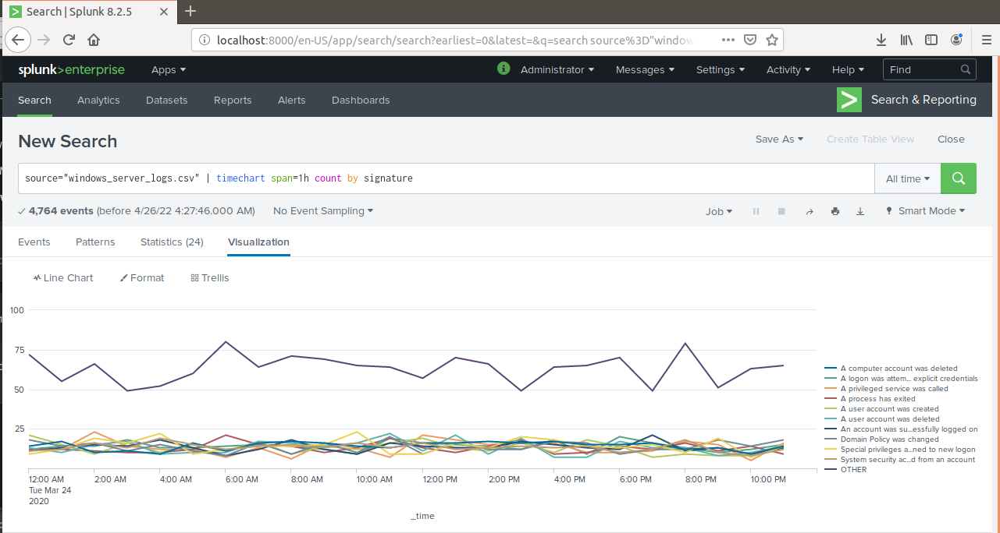
	

2. A line chart that displays the different `user` field values over time. 

	- `source="windows_server_logs.csv" | timechart span=1h count by user`

    
    
	

3. A bar, column, or pie chart that illustrates the count of different signatures.

	- `source="windows_server_logs.csv" | top limit=10 signature`

    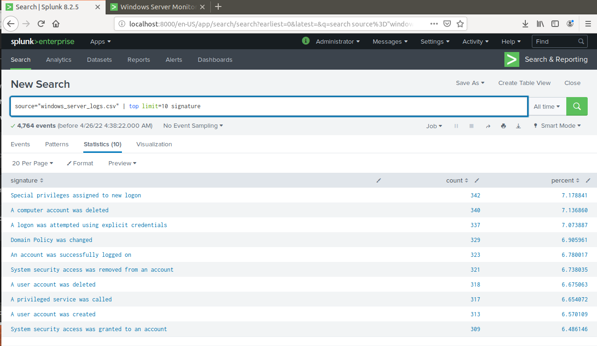
    
	

4. A bar, column, or pie chart that illustrates the count of different users.

	- `source="windows_server_logs.csv" | top limit=10 user`
    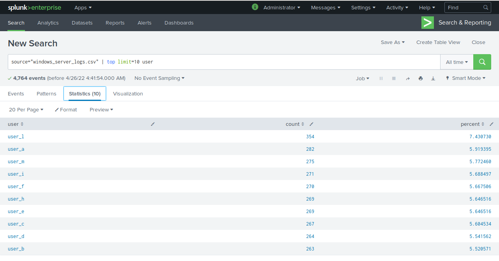
    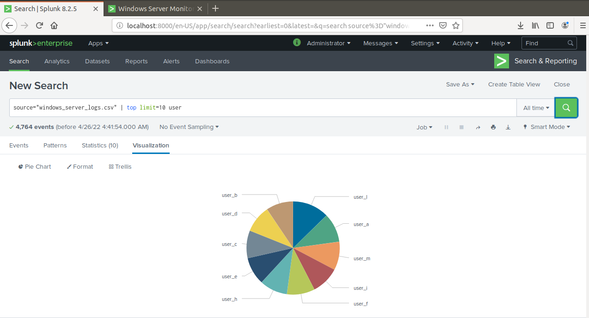
	

5. A statistical chart that illustrates the count of different users.

	- `source="windows_server_logs.csv" | top limit=10 user`
    
	

6. One single value visualization of your choice: radial gauge, marker gauge, etc.  
			
	
    

On your dashboard, add the ability to change the time range for all your visualizations.

---

### Apache Web Server Logs

**Reports**: Design the following reports to assist VSI with quickly identifying specific information.

1. A report that shows a table of the different HTTP methods (GET, POST, HEAD, etc).

	- `source="apache_logs.txt" | top method`

	
    	

2. A report that shows the top 10 domains that referred to VSI's website.

	- `source="apache_logs.txt" | top limit=10 referer_domain`

	
		

3. A report that shows the count of the HTTP response codes.
	
	- `source="apache_logs.txt" | top status`

	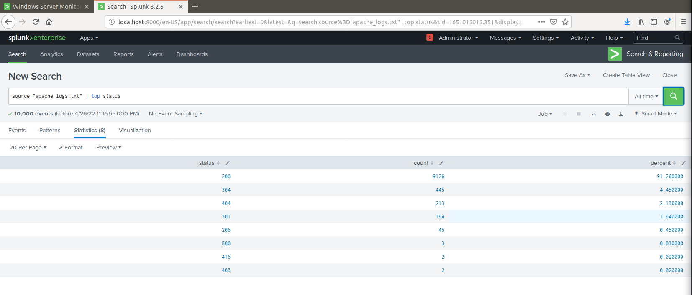
		
	

**Alerts**: Design the following alerts:

1. Determine a baseline and threshold for hourly count of activity from a country other than the United States. Create an alert to trigger when the threshold has been reached. The alert should trigger an email to SOC@VSI-company.com.

	- `source="apache_logs.txt"  | iplocation clientip | where Country!="United States"`

	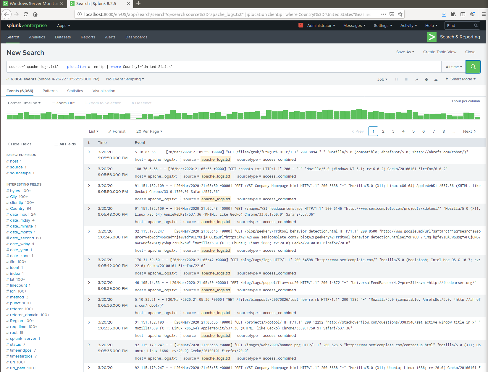
    

	- The average activity per hour is approximately 75.

	- Therefore the threshold is set for 200.

	- To create an alert, change the search to one hour.

	- Set to run every hour.

	- Set alert to trigger when count is greater than chosen threshold of (200).

	- Add action **Send email** to SOC@VSI-company.com.             

2. Determine a baseline and threshold for hourly count of the HTTP POST method. Create an alert to trigger when the threshold has been reached. The alert should trigger an email to SOC@VSI-company.com.

	- `source="apache_logs.txt" method=POST`

	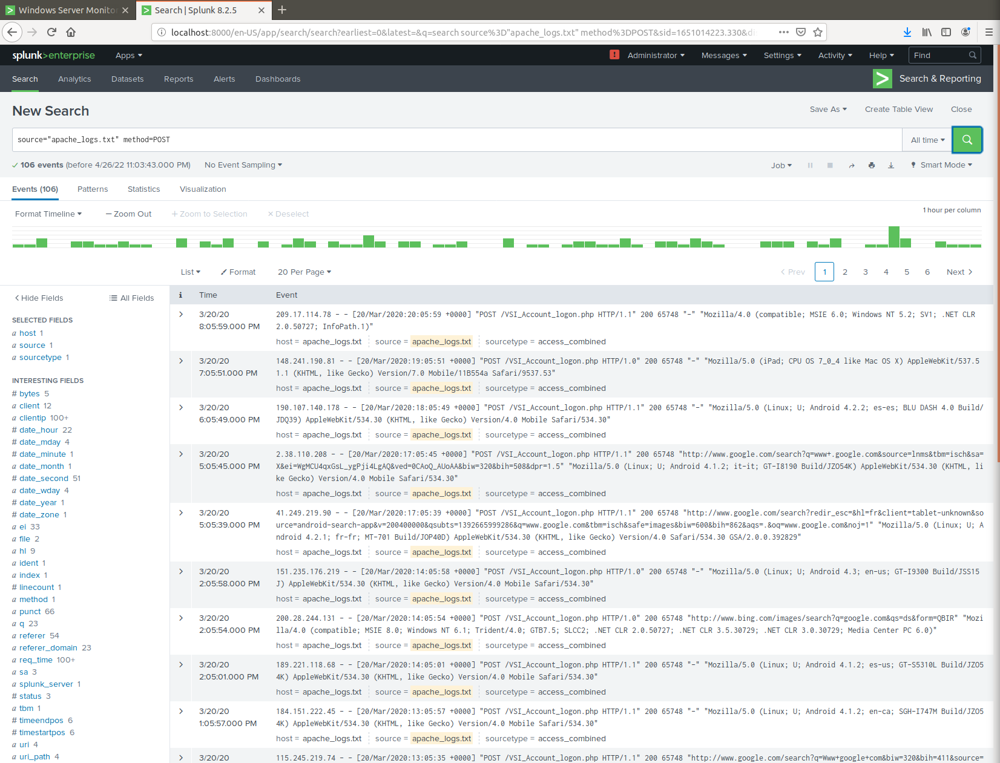
    

	- The average activity per hour is approximately 5.

	- Therefore the threshold is set for 15.

	- To create an alert, change the search to one hour.

	- Set to run every hour.

	- Set alert to trigger when count is greater than chosen threshold of (15).

	- Add action **Send email** to SOC@VSI-company.com. 		

**Visualizations and Dashboards**: Design the following visualization and add them to a dashboard called Apache WebServer Monitoring.

1. A line chart that displays the different HTTP `methods` field over time.

	- `source="apache_logs.txt" | timechart span=1h count by method`

    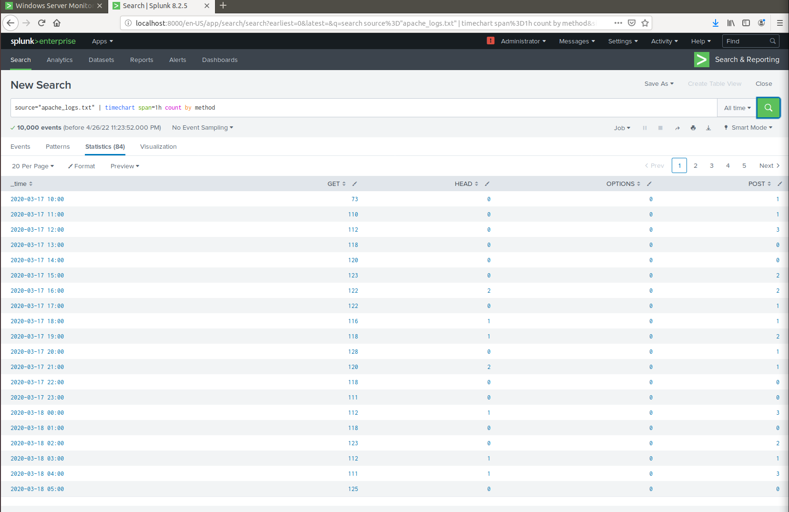	
	

2. A geographical map showing the location based on the `clientip` field.

    - `source="apache_logs.txt" | iplocation clientip | geostats count`

    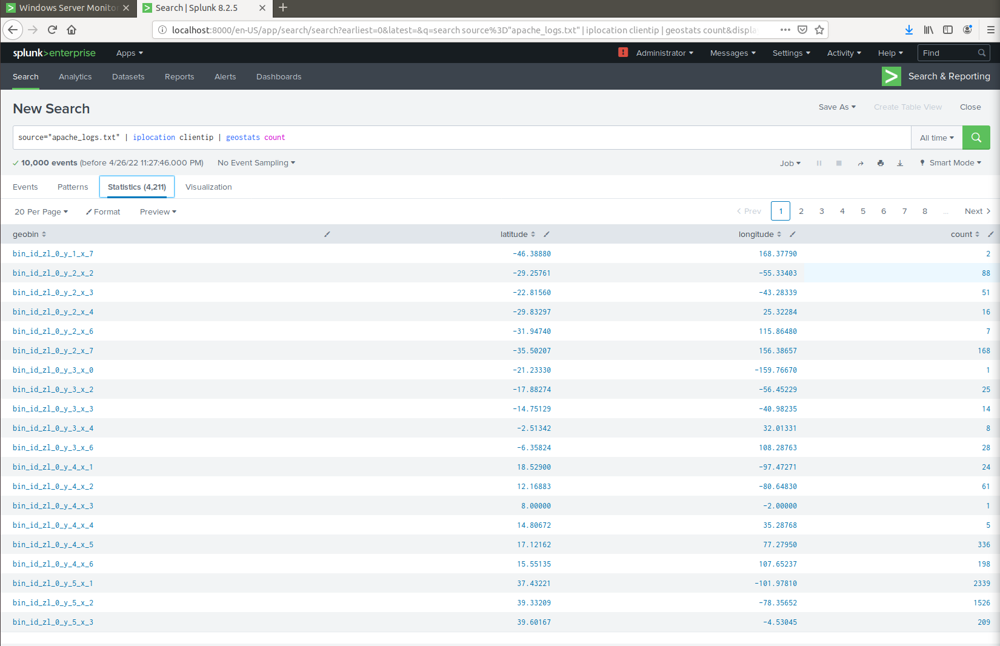
	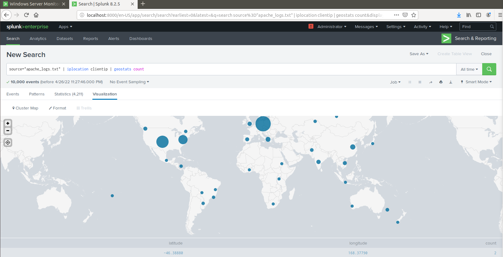

3. A bar, column, or pie chart that displays the count of different URIs.

	- `source="apache_logs.txt" | top limit=10 uri`

    
    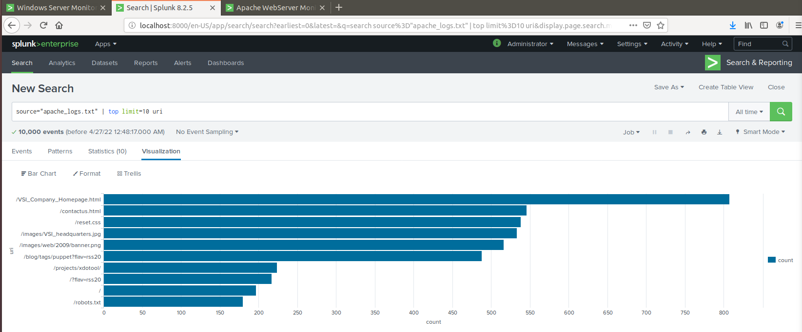

4. A bar, column, or pie chart that displays the counts of the top 10 countries.

	- `source="apache_logs.txt"  | iplocation clientip | top limit=10 Country`

    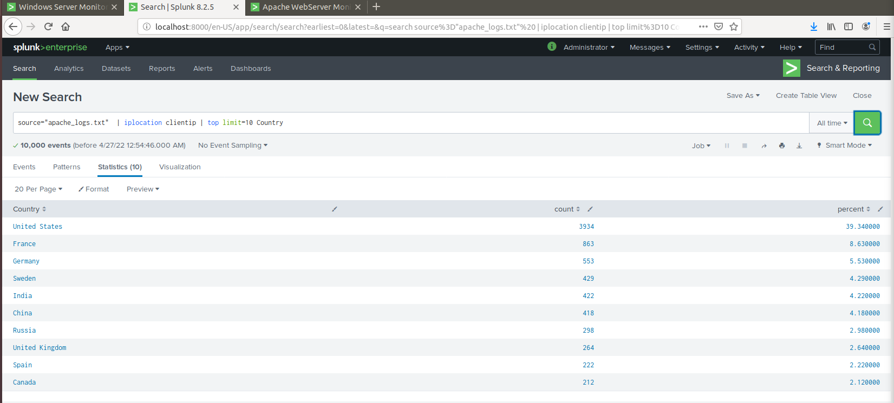
	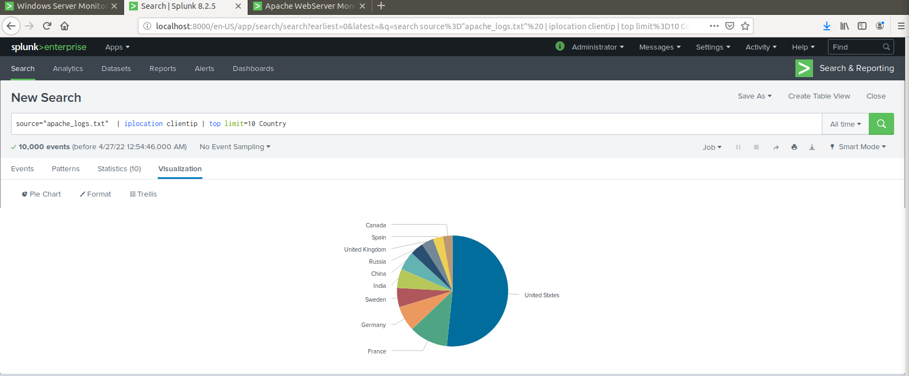

5. A statistical chart that illustrates the count of different user agents.

	- `source="apache_logs.txt"  |  top limit=10 useragent`

    

6. One single value visualization of your choice: radial gauge, marker gauge, etc.     

	
    
		
On your dashboard, add the ability to change the time range for all your visualizations.

---

© 2020 Trilogy Education Services, a 2U, Inc. brand. All Rights Reserved.

---  
