**Task:** Create a report to determine the impact that the DDOS attack had on download and upload speed. Additionally, create an additional field to calculate the ratio of the upload speed to the download speed.

1.  Upload the following file of the system speeds around the time of the attack.
    - [Speed Test File](resources/server_speedtest.csv)

2. Using the `eval` command, create a field called `ratio` that shows the ratio between the upload and download speeds.
   - Hint: The format for creating a ratio is: `| eval new_field_name = 'fieldA'  / 'fieldB'`
      
3. Create a report using the Splunk's `table` command to display the following fields in a statistics report:
    - `_time`
    - `IP_ADDRESS`
    - `DOWNLOAD_MEGABITS`
    - `UPLOAD_MEGABITS`
    - `ratio`
  
   Hint: Use the following format when for the `table` command: `| table fieldA  fieldB fieldC`

4. Answer the following questions:

    - Based on the report created, what is the approximate date and time of the attack?
      - _The appoximate date and time of the attack is February 23, 2020 at 2:30pm. The download speed dropped drastically the lowest point being at **7.87** this lasted until February 23, 2020 at 11:30pm, where there was a full recovery with speeds back up to **123.91**._
    - How long did it take your systems to recover?
      - _The total time the system was affected was **9 hours** from **2:30pm to 11:30pm** on February 23, 2020._

    - Command for showing upload and download results
      - `source="server_speedtest.csv" host="server_speedtest.csv" sourcetype="csv" | eval ratio='DOWNLOAD_MEGABITS'/'UPLOAD_MEGABITS'`

    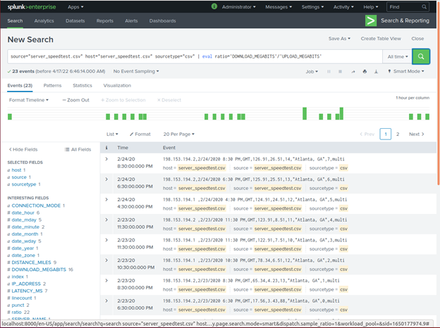
    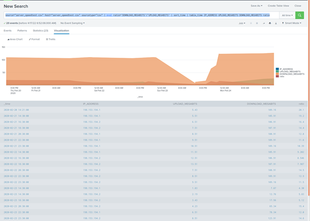

    - Command for Speed Report sorted by time
      - `source="server_speedtest.csv" host="server_speedtest.csv" sourcetype="csv" | eval ratio='DOWNLOAD_MEGABITS'/'UPLOAD_MEGABITS' | sort_time | table_time IP_ADDRESS UPLOAD_MEGABITS DOWNLOAD_MEGABITS ratio`

    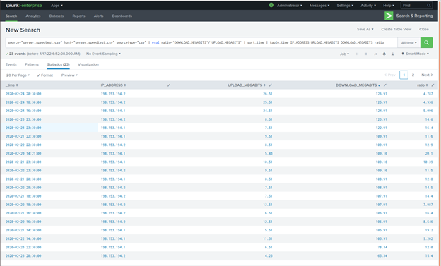
    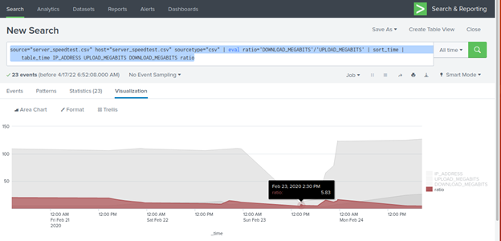

 
### Step 2: Are We Vulnerable? 

**Background:**  Due to the frequency of attacks, your manager needs to be sure that sensitive customer data on their servers is not vulnerable. Since Vandalay uses Nessus vulnerability scanners, you have pulled the last 24 hours of scans to see if there are any critical vulnerabilities.

  - For more information on Nessus, read the following link: https://www.tenable.com/products/nessus

**Task:** Create a report determining how many critical vulnerabilities exist on the customer data server. Then, build an alert to notify your team if a critical vulnerability reappears on this server.

1. Upload the following file from the Nessus vulnerability scan.
   - [Nessus Scan Results](resources/nessus_logs.csv)

2. Create a report that shows the `count` of critical vulnerabilities from the customer database server.
   - The database server IP is `10.11.36.23`.
   - The field that identifies the level of vulnerabilities is `severity`.
   - Command to show critical and non-critcal results
     - `source="nessus_logs.csv" host="nessus_logs.csv" dest_ip="10.11.36.23" | eval CRITICAL=IF(severity="critical", "Critical", "Non-Critical") | stats count by CRITICAL`

     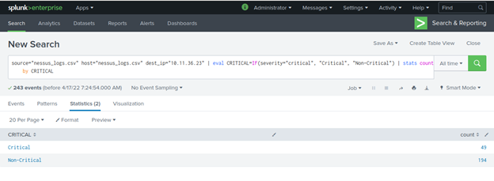
      
3. Build an alert that monitors every day to see if this server has any critical vulnerabilities. If a vulnerability exists, have an alert emailed to `soc@vandalay.com`.
   
   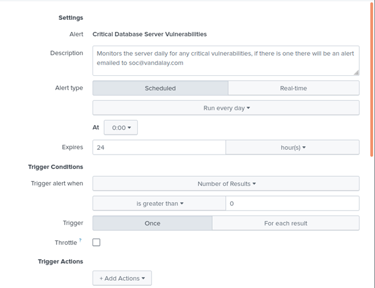
   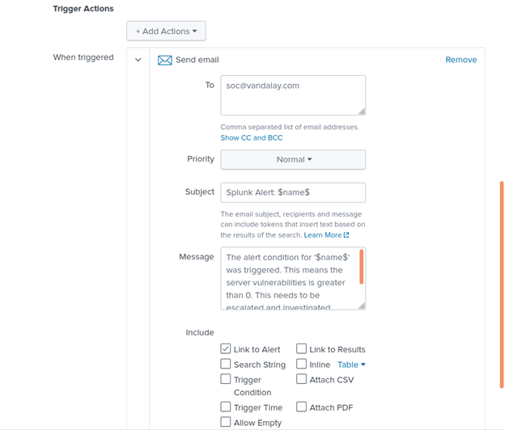
   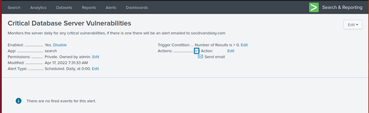

Submit a screenshot of your report and a screenshot of proof that the alert has been created.

### Step 3: Drawing the (base)line

**Background:**  A Vandaly server is also experiencing brute force attacks into their administrator account. Management would like you to set up monitoring to notify the SOC team if a brute force attack occurs again.

**Task:** Analyze administrator logs that document a brute force attack. Then, create a baseline of the ordinary amount of administrator bad logins and determine a threshold to indicate if a brute force attack is occurring.

1. Upload the administrator login logs.
   - [Admin Logins](resources/Administrator_logs.csv)

2. When did the brute force attack occur?
   - Hints:
     - Look for the `name` field to find failed logins.
     - Note the attack lasted several hours.
      
3. Determine a baseline of normal activity and a threshold that would alert if a brute force attack is occurring.
    - Command to query the brute force login attempts
      - `source="Administrator_logs.csv" host="administrator_logs.csv" sourcetype="csv" | stats count by name | sort - count | eval BruteForce=IF(name="An accouunt failed to log on" AND count>5, "Potential Brute Force", "Not Brute Force")`

    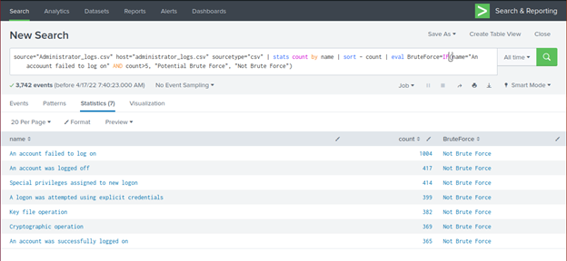
    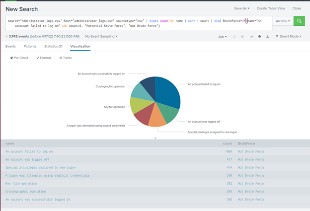

4. Design an alert to check the threshold every hour and email the SOC team at SOC@vandalay.com if triggered.
    - _Looking under the **name** field shows that the highest origin of attack was by **"An account failed to log on"** by using this information I was able to estanlish a baseline and the threshold._
      - _The Brute Force attack occured from **9am until 2pm** on February 21, 2022 for a total of **5 hours**._
      - _The baseline is between **5 to 35** logs an hour. With the basline being set in a range of 5-35, the alert will be created to monitor for 40 or more login attempts per hour. The alert will be sent to SOC@vandalay.com when the alert is triggered._

    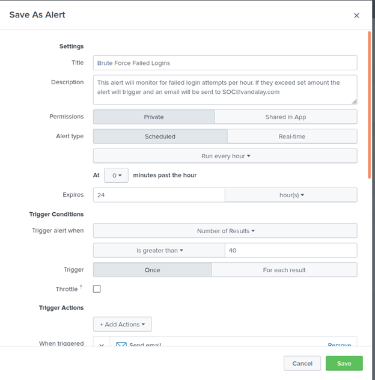
    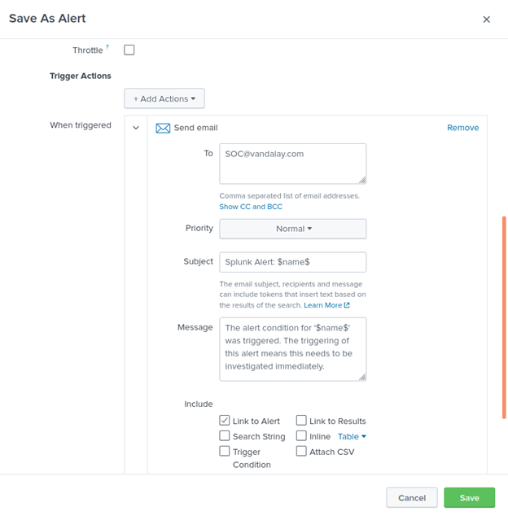
    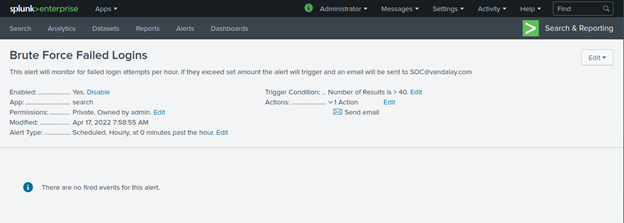

Submit the answers to the questions about the brute force timing, baseline and threshold. Additionally, provide a screenshot as proof that the alert has been created.

---