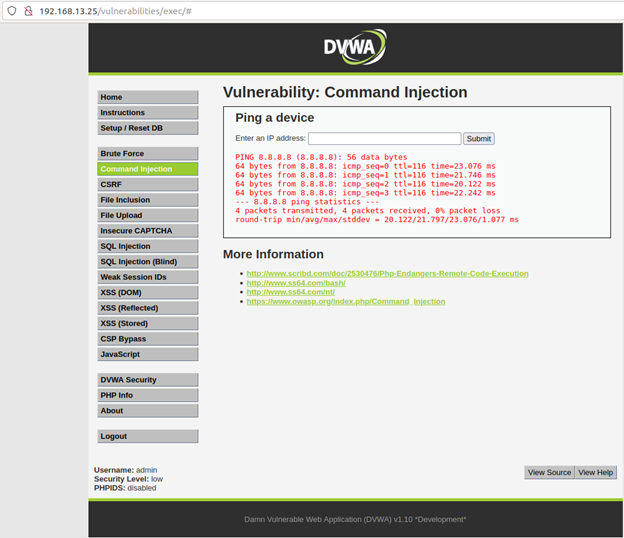
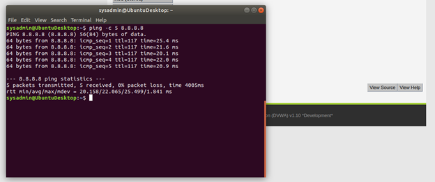
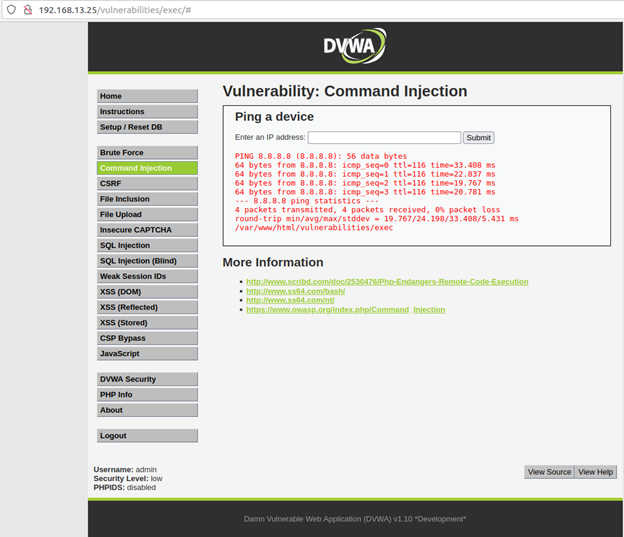
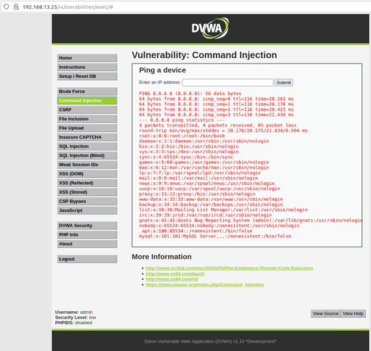
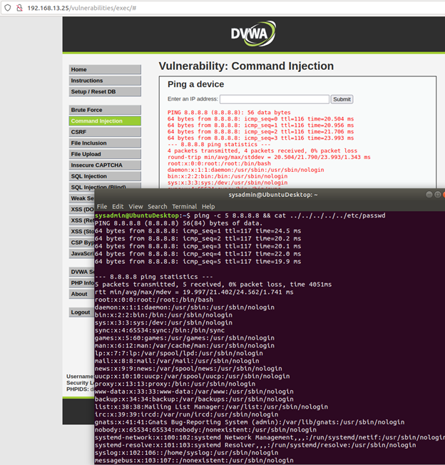
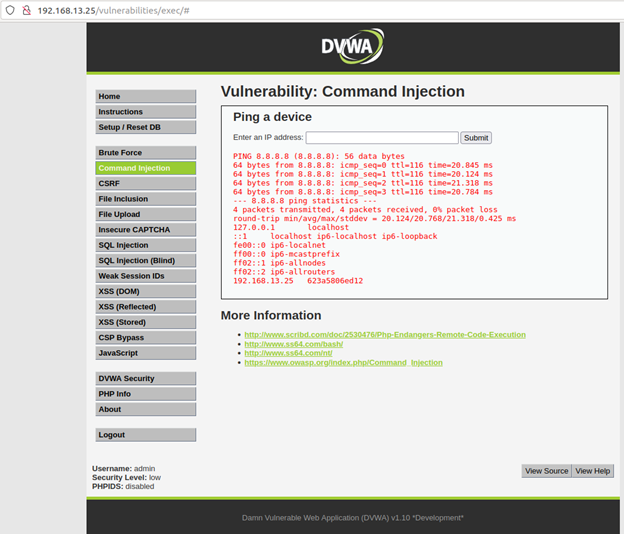
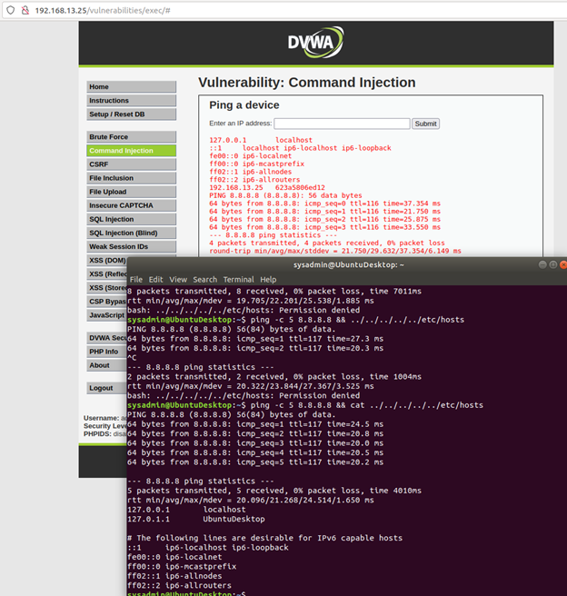

### Web Application 1: *Your Wish is My Command Injection*

1. Complete the following to set up the activity.

    

    - To launch the environment, complete the following:

      - Launch Vagrant from GitBash or the Mac terminal using the following command: `vagrant up`
      
      - Then, open the command line inside Vagrant and run the following command: `cd ./Documents/web-vulns && docker-compose up`.

      - Leave this page open and continue to the next step. 

    - To access the Replicants website, open a web browser within Vagrant and access the following webpage: <http://192.168.13.25/setup.php>.

      - On the bottom of this page, click **Create / Reset Database**.
      
      - This will configure the database for the application.
        
      - The message "Setup Successful" at the bottom of the page will indicate that it is complete. 

      - To log in to the mock Replicants website, access the following webpage: <http://192.168.13.25/login.php>.

        - Log in with the following credentials:
          
          - Username: `admin`
          
          - Password: `password`

    

2. This page is a new web application built by Replicants in order to enable their customers to `ping` an IP address. The web page will return the results of the ping command back to the user.

   Complete the following steps to walkthrough the intended purpose of the web application. 

   - Test the webpage by entering the IP address `8.8.8.8`. Press Submit to see the results display on the web application.

     

     - Behind the scenes, when you select Submit, the IP you type in the field is *injected* into a command that is run against the Replicants webserver. The specific command that ran on the webserver is `ping <IP>` and `8.8.8.8` is the field value that is injected into that command.
     
     - This process is no different than if we went to the command line and typed that same command: `ping 8.8.8.8`

       

3. Test if we can manipulate the input to cause an unintended result.

    - On the same webpage, enter the following command (payload) in the field: `8.8.8.8 && pwd`

    - This command uses two ampersands to add a second command to the original request:

      - `pwd` is the second command. It will display the directory location where the command is run on the Replicants webserver.
     
      - This would be no different than running `ping 8.8.8.8 && pwd` on the command line. 
  
   - Press Enter. Note the ping results are the results of the second `pwd` command:

     

    This type of injection attack is called **Command Injection**, and it is dependent on the web application taking user input to run a command against an operating system.

4. Now that you have determined that Replicants new application is vulnerable to command injection, you are tasked with using the dot-dot-slash method to design two payloads that will display the contents of the following files:
   
   - `/etc/passwd`

     
     
   
   - `/etc/hosts`

     
     
  
   **Hint:** Try testing out a command directly on the command line to help design your payload.

5. **Deliverable**: Take a screen shot confirming that this exploit was successfully executed and provide 2-3 sentences outlining mitigation strategies.
   - _Avoid command line calls_
   - _Set up input validation, Command Injection vulnerabilities occur when untrusted input is not sanitized correctly._
   - _Have restricted permissions, Reduce the number of users to access the database_ 

### Web Application 2: *A Brute Force to Be Reckoned With*

1. Complete the following steps to set up the activity. 

    - Open a browser on Vagrant and navigate to the webpage <http://192.168.13.35/install.php>.
  
    -  The page should look like the following:

       

    - Click "here" to install bWapp. (See the arrow in the previous screenshot.) 
    
    - After successfully installing bWapp, use the following credentials to login.

      - Login: `bee`

      - Password: `bug`

       

 
    - This will take you to the following page:

      

    - To access the application where we will perform our activity, enter in the following URL: <http://192.168.13.35/ba_insecure_login_1.php>

      - This will take you to the following page:

        

2. This page is an administrative web application that serves as a simple login page. An administrator enters their username and password and selects Login.
     
    - If the user/password combination is correct, it will return a successful message.
     
    - If the user/password combination is incorrect, it will return the message, "Invalid credentials."

3. Years ago, Replicants had a systems breach and several administrators passwords were stolen by a malicious hacker. The malicious hacker was only able to capture a list of passwords, not the associated accounts' usernames. Your manager is concerned that one of the administrators that accesses this new web application is using one of these compromised passwords. Therefore, there is a risk that the malicious hacker can use these passwords to access an administrator's account and view confidential data.

   - Use the web application tool **Burp Suite**, specifically the **Burp Suite Intruder** feature, to determine if any of the administrator accounts are vulnerable to a brute force attack on this web application. 

   - You've been provided with a list of administrators and the breached passwords:

     - [List of Administrators](listofadmins.txt)
     
     - [Breached list of Passwords](breached_passwords.txt)
  
   - Hint: Refer back to the Burp Intruder activity `10_Brute_Force` from Day 3 for guidance.
 
4. **Deliverable**: Take a screen shot confirming that this exploit was successfully executed and provide 2-3 sentences outlining mitigation strategies. 

### Web Application 3: *Where's the BeEF?*

1. Complete the following to set up the activity. 

   - On Vagrant, open a command line and run the following command: `sudo beef`

   - When prompted for a password, enter `cybersecurity`.

   - This will kick off the BeEF application and return many details about the application to your terminal.

   - Along with these details are several URLs that can be used to access to BeEF's User Interface (UI). For example: `UI_URL: http://127.0.0.1:3000/ui/panel` 
   
   - To access the BeEF GUI, right-click the first URL and select Open Link.

     

   - When the BeEF webpage opens, login with the following credentials:
     - Username: `beef`
     
     - Password: `feeb`

     

   - You have successfully completed the setup when you have reached the `BeEF Control Panel` shown in the image below:

     

2. The Browser Exploitation Framework (BeEF) is a practical client-side attack tool that exploits vulnerabilities of web browsers to assess the security posture of a target.      

   - While BeEF was developed for lawful research and penetration testing, criminal hackers leverage it as an attack tool.
  
   - An attacker takes a small snippet of code, called a BeEF Hook, and determines a way to add this code into a target website. This is commonly done by cross-site scripting.

   - When subsequent users access the infected website, the users' browsers become *hooked*.
     - Once a browser is hooked, it is referred to as a **zombie**. A zombie is an infected browser that awaits instructions from the BeEF control panel.
     - The BeEF control panel has hundreds of exploits that can be launch against the *hooked* victims, including:
       - Social engineering attacks 
       - Stealing confidential data from the victim's machine
       - Accessing system and network information from the victim's machine
       
3. BeEF includes a feature to test out a simulation of an infected website.
    
    - To access this simulated infected website, locate the following sentence on the BeEF control panel: `To begin with, you can point a browser towards the basic demo page here, or the advanced version here.`
    
    - Click the second "here" to access the advanced version.  
     
       

    - This will open the following website, which has been infected with a BeEF hook.

       

    - Note that once you have pulled up this infected webpage, your browser has now been hooked!

    	- If your browser has not been hooked, restart your browser and try again.

    -  Return to the control panel. On the left side, you can notice that your browser has become infected since accessing the infected Butcher website. Note that if multiple browsers become infected they will all be listed individually on the left hand side of this panel.

      - Click on the browser `127.0.0.1` as indicated in the screenshot below.

        

      - Under the Details tab, we can see information about the infected browser. 

4. Now we are ready to test an exploit.

    - Select the Commands tabs. 
    
      - This will list folders of hundreds of exploits that can be ran against the hooked browser. Note that many may not work, as they are dependent on the browser and security settings enabled.
  
   - First, we'll attempt a social engineering phishing exploit to create a fake Google login pop up. We can use this to capture user credentials.
     
   - To access this exploit, select Google Phishing under Social Engineering.

       

   - After selecting this option, the description of the exploit and any dependencies or options are displayed in the panel on the right.

       

   - To launch the exploit, select Execute in the bottom right corner.

     - After selecting Execute, return back to your browser that was displaying the Butcher Shop website. Note that it has been changed to a Google login page.

     - A victim could easily mistake this for a real login prompt.

   - Lets see what would happen if a victim entered in their credentials. Use the following credentials to login in to the fake Google page. 
     - Username: `hackeruser`
     - Password: `hackerpass`

       

   - Return to the BeEF control panel. In the center panel, select the first option. Note that now on the right panel, the username and password have been captured by the attacker.

     

5. Now that you know how to use the BeEF tool, you'll use it to test the Replicants web application. You are tasked with using a stored XSS attack to inject a BeEF hook into Replicants' main website.

   - Task details:
     - The page you will test is the Replicants Stored XSS application which was used the first day of this unit: `http://192.168.13.25/vulnerabilities/xss_s/`
     - The BeEF hook, which was returned after running the `sudo beef` command was: `http://127.0.0.1:3000/hook.js`
     - The payload to inject with this BeEF hook is: ``

   -  When you attempt to inject this payload,  you will encounter a client-side limitation that will not allow you to enter the whole payload. You will need to find away around this limitation.    
      
      - **Hint:** Try right-clicking and selecting "Inspecting the Element".
    
   - Once you are able to hook into Replicants website, attempt a couple BeEF exploits. Some that work well include:
     
     - Social Engineering >> Pretty Theft
     
     - Social Engineering >> Fake Notification Bar
     
     - Host >> Get Geolocation (Third Party)
    
6. **Deliverable**: Take a screen shot confirming that this exploit was successfully executed and provide 2-3 sentences outlining mitigation strategies. 

---

© 2021 Trilogy Education Services, a 2U, Inc. brand. All Rights Reserved.

