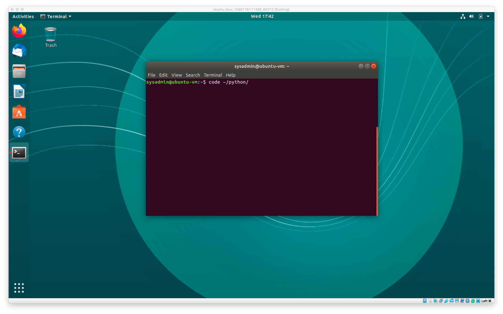
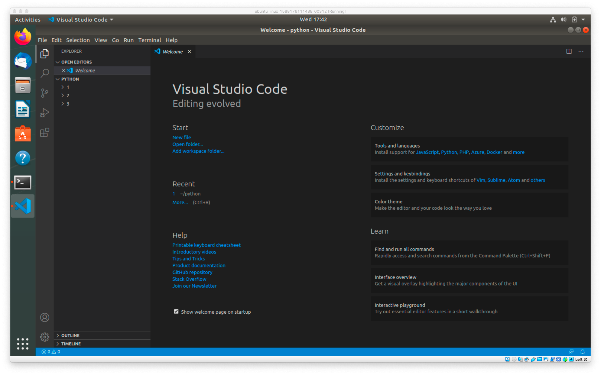
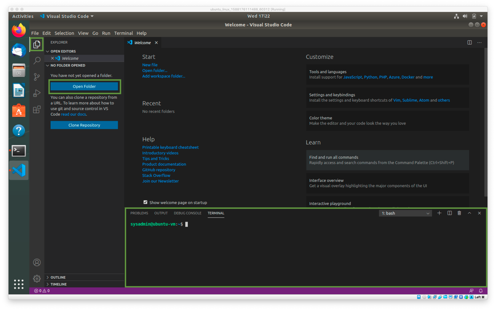
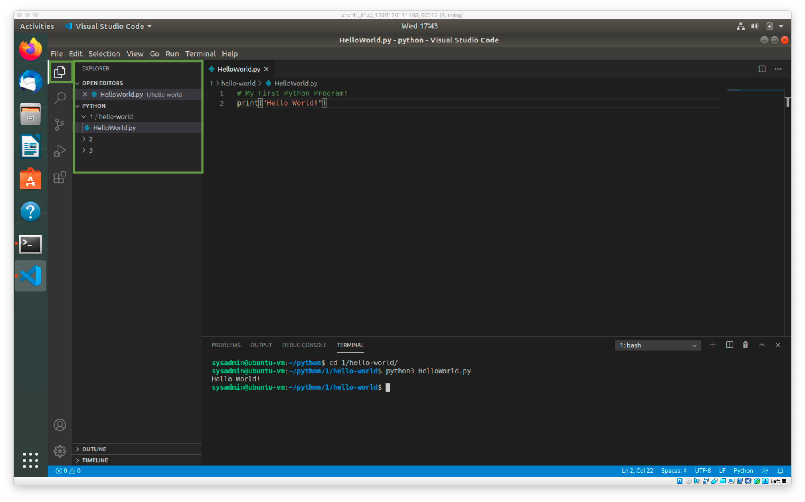
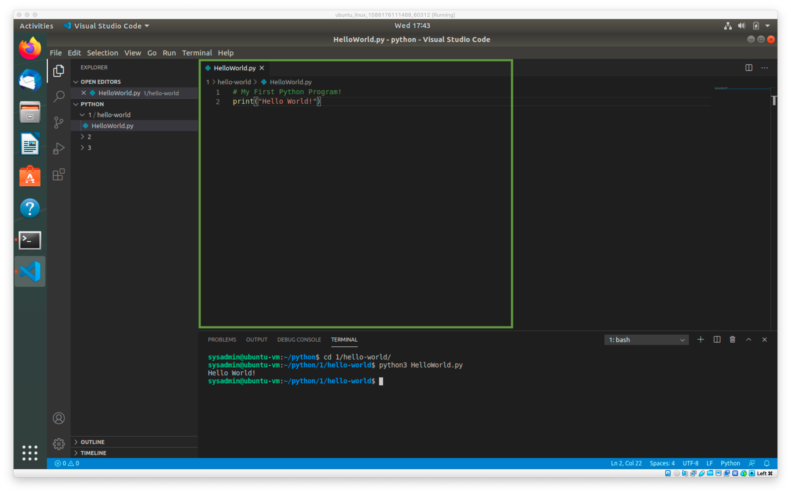
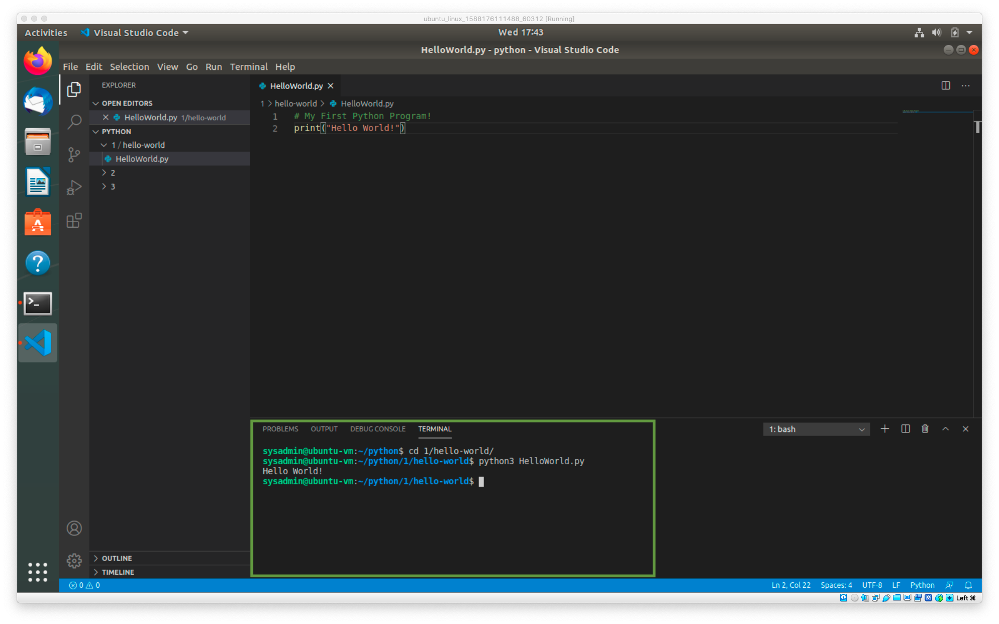

## Lesson 1: The Power of Python

### Overview

In this lesson, you will be introduced to the Python coding language. In order to apply Python to cybersecurity applications, you will first need to learn the basics of syntax, variables, lists, and dictionaries. 


### Objectives

By the end of the lesson, you will be able to:
- Create and run Python files via the terminal using VS Code.
- Use the `print()` function to print lines to the console.
- Use basic Python elements like variables and operators. 
- Use the Python `input()` function to retrieve, store, and utilize user inputs. 
- Reference and store collections of data using lists.
- Use `listVariable.append(Value)`, `listVariable.index(Value)`, and `listVariable.remove(Value)` to add, return, and delete values from a list.
- Use the `len(listVariable)` function to return the length of a list.
- Create and reference data in dictionaries.

### Table of Contents

1. [Why Python?](###1.-Why-Python?)
2. [Hello World](###2.-Hello-World!)
3. [Variables and Data Types](###-3.-Variables-and-Data-Types)
4. [Operators](###-4.-Operators)
5. [Challenge: Variable Dissection](###-5.-Challenge-Variable-Dissection)
6. [Challenge: Variable Address](###-6.-Challenge-Variable-Address)
7. [User Input](###-7.-User-Input)
8. [Challenge: Down to Input](###-8.-Challenge-Down-to-Input-Challenge)
9. [Lists](###-9.-Lists)
10. [Challenge: Messy Lists](###-10.-Challenge-Messy-Lists) 
11. [Dictionaries](###-11.-Dictionaries)
12. [Challenge: Hobby Book](###-12.-Challenge-Hobby-Book)

### Setup Notes

To complete this lesson, you will use your local Vagrant virtual machine.
- Student access:
	- Username: `sysadmin`
	- Password: `cybersecurity`

Your machine will already have Python installed, as well as VS Code.

- VS Code is a coding environment that allows you to see your code and run it using a built-in command line.

- To open VS Code, open your terminal and run the command `code ~/python`.

  

- This opens the directory `~/python` in VS Code. Here you can see all of the activities and directly work on your code.

- Alternatively, you can run `code`, click the button to open a folder, and select the `~/python` folder.

  

Press Ctrl+~ to open a terminal window at the bottom of the VS Code window.



VS Code has three main panels:

- The left panel is a file explorer where you can view and search for files you are working on.

	

- The top middle panel is where you will edit your files and enter your code.

	

- The bottom panel is a terminal where you will run your code. You can toggle up or down with Ctrl+~.

  

----

### 01. Why Python? 
In the following lessons, you will be introduced to the coding language **Python**, and how it can be used in similar basic sysadmin tasks and more specific cybersecurity-related tasks. 

Python is a high-level, general purpose programming language used for a variety of applications and fields. 

- Python has an enormous community of developers behind it with backgrounds in a variety of industries and jobs.

- Python provides opportunities to use other people's code. 

- Python prioritizes readability and ease of use.

	- The syntax is incredibly readable, making it an excellent introductory programming language, while still being powerful and used by programmers of all levels. 

	- Python forces you to follow certain rules to make the code readable. Well-written code is easier for everyone to read, which improves team collaboration. 

We've just covered some basic, high-level benefits of Python. But why is it important for security professionals to know it?

- Learning Python is a huge competitive advantage for technically-oriented cybersecurity jobs. 
- For example, it is used heavily when configuring and maintaining the latest Security Orchestration, Automation and Response (SOAR) platforms. 
 

Compared with shell scripts, which are great for OS-level interactions, dealing with processes and file systems, Python is geared towards logic-based applications and the automation of complex tasks. 

- Most programmers will use both Python and bash. Python allows us to write complex applications and do logic with relative ease, but the terminal/bash is most useful for OS and file system interaction.

Now that you know a little bit about Python, let's get coding!

---

### 02. Hello World!

In this section, you will:

- Create a Python script file.
- Learn basic Python syntax.
- Use the `print` function to print text to screen.

Following in the footsteps of programmers across the globe, you will start by writing a simple script that prints `Hello world!` to the console. 

#### Hello World Script Code Along

1. Open VS Code and create a new file.

2. Before typing anything into the editor, save the file as `HelloWorld.py`. 
	 - The .py extension indicates that the contents of this file should be read as Python code. This is required for VS Code to provide syntax highlighting.


3. On the top line of the file, type: `# My First Python Program!`.

	 - As with bash, the hash symbol `#` in Python indicates a **comment**. 

	 - Remember, comments are non-executable lines of text that programmers add to scripts to provide commentary, instruction, or in this case, a title. 

     - Comments start with a `#`. The computer ignores anything after a `#`, so a comment will never affect how your code runs.

	 	- **Tip**: Highlighting a line of text in VS Code and pressing Ctrl+/ will comment out the line. To uncomment text, select it and use the same key combination of Ctrl+/.

4. Below your comment, type: `print("Hello World!")`.

	 - `print()` prints the content between the parentheses to the screen. 
	 - In this case, the command will print the phrase `Hello World!`. 
	 - The phrase must be surrounded with quotation marks within the parentheses.


5. Your script should resemble the following:

	```python
	# My First Python Program!
	print("Hello World!")
	```

6. Save the script and press Ctrl+~ to open a command line at the bottom of the VS Code window.

7. In the terminal, run `ls` to verify that you can see your new `HelloWorld.py` script.
     
	 - Make sure you are located in the same directory as the script. 
	 - Use `cd` to change directories into the appropriate directory of the `HelloWorld.py` script.
     

8. Execute the script by running: `python3 ./HelloWorld.py`.

	 - Your terminal output should look like this:

		```bash
		$ ls
		HelloWorld.py

		$ python3 HelloWorld.py
		Hello World!
		```
	 
	 - Note that Python scripts are executed with the following general syntax: 
	 	
		 ```
		 python3 /path/to/script
		 ```

	  - It is very important to pass the correct path to the script. If you try to run `python3 ./HelloWorld.py` inside of a different directory, the command will fail because the `./HelloWorld.py` script exists in a different folder.


**Bonus**
- Create a new Python script that prints `Goodnight World!` and run it in the console.

 - The completed script can be found here: [Goodnight World Script](Activities/02-Hello-World/GoodnightWorld.py) 

---

### 03. Variables and Data Types

In this section, you will: 

- Create Python variables for integers, floats, booleans, and strings.

- Print values by calling on their assigned variables. 

- Change the values of variables. 

In the previous exercise, you wrote a script that printed a message to the console. This message is just one example of data that scripts can work with. In practical, real-world applications, scripts are used to complete tasks on a variety of data, such as a file path, number, and countless other examples. 

We use **variables** to simplify how we work with data.

- As you learned in the bash scripting and Windows PowerShell classes, variables are used to store and reference data by assigning values to keywords.

-  Variables can then be used later by an application to call on those values.

	- For example: 
	```python
		my_name = 'Tamir'
	```

Code that creates a variable is called a **variable assignment**. This example depicts a variable assignment in which the variable `my_name` is assigned the value `'Tamir'`.

- **Note:** The name of a variable always appears on the left-hand side of a variable assignment. The value always appears on the right.

- The name of the variable can be *almost* anything. Keep in mind the following guidelines when creating variables:
	- Do not use Python keywords such as `for`, `while`, `True`, etc.

	- Variable names cannot start with a number, such as `1fish`.

	- Programmers spend 90% of their time reading code. Make your programs easy to read with descriptive variable names. For example: `path_to_scan_results`.

Programs must work with many kinds of data: PDF files, log data, MP3s, etc. When you start writing scripts, you will find that it is important to know what kind of data you are working with.

Python variables allow you to store four main kinds of data:
- Integers
- Floats
- Booleans
- Strings

In the following exercise, you will create a Python script that assigns data to these four types of variables. 

#### Variable Assignments Code Along 

Begin by opening the [Variables-1-Basics-Types.py](Activities/03-Variables-and-Data-Types/Variables-1-Basics-Types.py) script in VS Code.
   - This is an example of a script that assigns values to different kinds of Python variables. 

   - As you learn more about integers, floats, booleans, and strings, you will add your own variable assignments to a script. 

		```python
		# Variable Assignment
		# ===============================
		# Integers
		int_variable = 10

		# Floats
		float_variable = 1.25

		# Booleans
		boolean_variable = True

		# Strings
		string_variable = "Hello World!"
		```

Next, create your own blank script named `variables.py`. Add each code sample below to your own script, as instructed. 


1. **Integers** are whole numbers that can be either positive or negative. While there are limits to how large integers can be in other programming languages, Python allows for integers of any amount. 

    - Type the following code into your `variable.py` script:

		- **Note**: To become truly proficient at coding, it is very important that you type out all code samples, rather than copying and pasting.

		```python
		# Integers
		int_variable = 10

		# Other Examples of Int Variables
		my_age = 32
		my_sisters_age = 46
		```

     - You can personalize your script by using any variable name you'd like. However, it is recommended that you be as descriptive as you can while still being concise. 

2. **Floats** are numbers with a decimal point. While integers must be whole numbers, floats can contain a fractional component.

	 - Type the following code into your script:

		```python
		# Floats
		float_variable = 1.25

		# Other examples of Float Variables
		avg_score = 4.25
		median_age = 48.6
		```


3. **Strings** are text contained within quotation marks. Strings can contain numbers, but these numbers will be treated as characters without any numeric value. 
	
	 - Type the following code into your script:

		```python
		# Strings
		string_variable = "Hello World!"

		# Other examples of strings
		sentence = "This is a basic sentence."
		hash = "4e76434eea3c9d9cf9cb10bbf3f4a74b"
		```

	  - Any character inside the quotation marks is considered part of the string. A string can be any length of characters. For example, you can hold an entire log file inside one variable as a string.


4. **Booleans** are logic data which denote whether something is considered true or false. 

	 - Type the following code into your script:

		```python
		# Booleans
		boolean_variable = True
		```
	 - Booleans are often used for `if then` statements, which we will look at later. 	


#### Printing and Referencing Variables

Previously, you used `print` to produce the string `Hello World!`. You will now use `print` along with a variable to produce the assigned value. When you call a variable in print, Python first looks up the value of the variable and then prints it. 

- **Note**: Unlike strings, you do not need quotations marks for printing a variable name. For example: `print('int_variable')` is wrong.

In the following exercise, you will add commands that print the value of variables. In these examples, we know the value of the variables, so the application may seem simple. However, in more sophisticated applications or when working with big data, we may not know the value of the variable. Therefore, variables allow us to save arbitrary data for later retrieval and manipulation.


Refer back to the [Variables-1-Basics-Types.py](Activities/03-Variables-and-Data-Types/Variables-1-Basics-Types.py) script and look at the `# Referencing and Printing` section.

You will create a similar section in your `variable.py` script. The `print` command will call on the variables you assigned in the last exercise. 

1.  Add the following code to your script:

	```python
	# Print variable values
	print(int_variable)
	print(float_variable)
	print(boolean_variable)
	print(string_variable)
	
	# Print variable types
	print(type(int_variable))
	print(type(float_variable))
	print(type(boolean_variable))
	print(type(string_variable))
	```

	- In this script, we are also using the `type` function. This function allows Python to check the variable type before printing. When working with more sophisticated code, this function is helpful if debugging requires us to check the type of a variable.

2. Run the script to see its output with `python3 variable.py`.

	- Your output should resemble:
		```python
		10
		1.25
		True
		Hello World!
		<class 'int'>
		<class 'float'>
		<class 'bool'>
		<class 'str'>
		```
	- This output shows both the value and type of each variable printed to the console.

3. The data within a variable can also be changed to a different value at any time, hence the name "variable."

	 - You can also assign the same variable different values at different points in a script. For example: 

		```python
		age = 30
		print(age) # prints 30

		age = 31
		print(age) #prints 31
		```

	 - The output shows that the value of `age` changes from `30` to `31`.

		```python
		$ python3 age.py
		30
		31
		```

 The value held by a variable can be changed at any time. This will become useful as your programs get more complicated. 

---

### 04. Operators 

In this section, you will:

- Operate on integers with arithmetic operators.
- Combine strings with concatenation.
- Combine two different types of variables by converting integers into strings and vice versa.

You can also **operate** on variables. This means using the data in variables to calculate and create new data. This is one of the key capabilities of programs.

The most basic operations are the **arithmetic** and **concatenation** operators. 

- Arithmetic operators are used to calculate numerical data. 

- Concatenation allows us to create new strings.

We've already used the `=` operator to assign or store a value to a variable. Other operators include: 

- Arithmetic: `+`, `-`, `*`, `/`
- Comparison: `<`, `>`, `==`, `!=`
- Logical: `and`, `or`, `not` 

In the following exercise, you will use various operators on strings to create new data. 

#### Operator Code Along

Similar to previous exercises, you will be provided a reference script, then create your own script and add similar code to it. Remember: typing out the code will help you master a language more quickly than copying and pasting. 

First, open the [Variables-2-Concatenation.py](Activities/04-Operators/Variables-2-Concatenation.py) reference script. 

```python
# Arithmetic Operation
# ==========================
count = 10 + 2
print(count)

# String Concatenation
# ==========================
hello = "Hello " + "World!"
print(hello)

# String Conversion and Concatenation
# ==========================
age = 27
words = "I am currently "
completeSentence = words + str(age)
print(completeSentence)
```

Now, create a new file called `cat.py`. Enter code to this file as indicated below. 

1. **Arithmetic.** You can use symbols for addition (`+`), subtraction (`-`), multiplication (`*`), and division (`/`) to create mathematic formulas in order to manipulate and create variables. 

	- Add the following code to your script: 

		```python
		# Arithmetic Operation
		# ==========================
		count = 10 + 2
		print(count)

		# Another example
		number1 = 5
		number2 = 8

		number3 = number1 + number2
		print(number3)
		```

		- In the first example, we add two numbers together and assign them to the variable `count`. Then, we use `print(count)` to print the value of the `count` variable, which is `12`.

		- In the second example, we assign numbers to variables and add the value of those variables together before assigning that sum to a new variable, `number3`. Then, we use `print(number3)` to print the value of the variable `number3`, which is `13`.
 

2. **Concatenation.** While arithmetic can only be used on integer and float variable types, we can use the `+` symbol to join ("concatenate") strings together. 

	- Add the following code to your script: 

		```python
		# String Concatenation
		# ==========================
		hello = "Hello " + "World!"
		print(hello)

		# Another example
		greeting = "Hello "
		name = "Derek!"
		print(greeting + name)
		```

		- The first example prints `Hello World!`. This is because we have concatenated two separate strings, `Hello` and `World!`, and assigned the value to the variable `hello`.

		- The second example prints `Hello Derek!`. This is because we have concatenated two string variables inside the `print` statement.

		- Using `+` to concatenate only works when each item is a string. If one of the items is an integer or boolean, an error will be returned. 

3. **String Conversion and Concatenation.** We can also convert an integer into a string and then concatenate that variable to a string. 

	- Add the following code to your script:

		```python
		# String Conversion and Concatenation
		# ==========================
		age = 27 # an int type variable
		words = "I am currently " # a string type variable
		completeSentence = words + str(age) # we must change age to be a string and not an int
		print(completeSentence)
		```
		
		- In this example, we convert the variable `age` from an integer to a string. If we simply wrote `completeSentence = words + age`, the script would return an error. This is because Python cannot calculate a sum unless both items are numbers, and cannot concatenate unless both items are strings. =

		-  Instead, we use the `str()` function when we want to convert a variable to a string before concatenating it with another string and using `print`.

---

### 05. Challenge: Variable Dissection

In the following exercise, you will analyze a script and determine the output of various `print` commands. 

#### Instructions

1. Open the [Variables-Dissect.py](Activities/05-Variable-Dissection/UNSOLVED-Variables-Dissect.py) script. 

2. Where indicated, update the code comments to include the output of each statement. Don't run the code until you've filled in every comment. 

3. Once every comment is filled in, run the code and compare the output to your commented answers. You can also use the [solution script](Activities/05-Variable-Dissection/SOLVED-Variables-Dissect.py) to compare your answers.

---

### 06. Challenge: Variable Address

Now that we have an understanding of variables and data types, we can begin to explore applications. Below, you will create variables that contain data describing a fictional website. Examples of such variables include:
- URL, e.g., http://example.com
- IP address, e.g., `67.82.10.21`
- Number of visitors per day

#### Instructions
1. Create a new script called `address.py`.
 
2. Create a variable called `URL` that contains `www.mycoolsite.com`.

3. Create a variable called `IP_address` that contains `216.3.128.12`.

4. Create a new variable for each weekday and set an integer value equal to how many hits the site received on those days. 
	- **Note:** Make up a number for each day.
  
5. Create a variable called `weekly_hits` and set it equal to the sum of the hits for every day of the week.

6. Create a variable called `average_hits` that divides `weekly_hits` by the number of days in a week. 

7. Print each variable to the terminal. 
	- **Note**: Remember to convert your integer variables to strings when printing!

**Bonus** 
- Review the following documentation: [w3schools: Python int() Function](https://www.w3schools.com/python/ref_func_int.asp).

	- After reviewing the page, convert `average_hits` from a float to an integer before printing your final statement. 

#### Review

When you are finished, compare your script with the [solution script](Activities/06-Variable-Address/SOLVED-VariableAddress.py).

Refer to the walkthrough below to review the steps: 

1. Start by assigning the URL, IP address, and days of the week:

	```python
	# Create a web address and store it in a variable
	URL = "www.mycoolsite.com"

	# Store the IP address within a string variable
	IP_address = "216.3.128.12"

	# Create some variables to store how many times the site was visited each day
	monday = 103
	tuesday = 126
	wednesday = 97
	thursday = 458
	friday = 78
	```

	 - These are standard variable assignments: 

		 - `URL` is holding the string `www.mycoolsite.com`.
		 - `IP_address` is holding the string `216.3.128.12`.
		 - Each day of the week is holding an integer.

2. To store the website's daily hits for the week, add the variables for each day of the week before storing the result within a new variable named `weekly_hits`.

	```python
	# Add up all the daily hits for the week and store them in a variable
	weekly_hits = monday + tuesday + wednesday + thursday + friday
	```

	- Since each weekday variable is holding an integer, the `+` sign will perform addition, and `weekly_hits` will be assigned the final sum of all the numbers. `weekly_hits` will be an integer variable. 

3. To store the average number of hits per day, divide the `weekly_hits` variable by seven before storing the result within the `average_hits` variable.

	```python 
	# Find the average daily hits for the week
	average_hits = weekly_hits / 7
	```

	 - Notice that since `weekly_hits` is holding an integer, we can treat it as a number in the arithmetic equation. Always be sure that the operation you want to perform on a variable is valid for the data it contains. 

4. When printing the website's weekly and average hits, we must convert the `weekly_hits` and `average_hits` variables into strings. If we do not do this conversion, we'll get an error.

	```python
	# Print all of the summaries to the screen
	print("URL: " + URL)
	print("IP: " + IP_address)
	print("Weekly Hits: " + str(weekly_hits))
	print("Average Hits: " + str(average_hits))
	```

	 - Note that `URL` and `IP_address` do not need conversion, because they are already string variables.

5. Finally, use the `int()` function to display average hits without decimals. `int()` is used similarly to `str()`, and attempts to convert any number you give it to a whole number. 

	```python
	average_hits_int = int(weekly_hits/7)
	print("Average Hits as int: " + str(average_hits_int))
	```

	 - `int()` does not round the decimal up or down. Rather, it truncates it by removing the fraction. For example, `int(3.9)` returns `3`, and `int(4.2)` returns `4`.

---

### 07. User Input

In this section, you will: 

- Create code that calls on users to input data.


In the previous examples, you defined data in your scripts directly. For example, you set `my_variable = 42`. In practice, you often won't know what the value of a variable should be. In this case, rather than setting it explicitly, you can ask the user to supply it for you.

- Consider the tool `apt-get`. When you run `apt-get install <package>`, the program stops and asks you if you're sure you want to install `<package>`. If you enter `Y` it proceeds, if you enter `N` it does not. In this section, you will learn to write Python programs that are able to collect and operate on this kind of **user input**.

Collecting user input consists of two basic steps:
- Printing a message that prompts the user for input.
- Saving the user's response to a variable.

In Python, the `input()` function does all of this for you. You can use the `input()` function as follows:

```python
# Note: Do not add this to your script file(s). It is only an example.
state = input("Please enter your state: ")
print(state)
```

Running this script generates the following output:

```python
  $ python state.py
  Please enter your state: New York
  New York
```

In this example, note that Python:
- Prints `Please enter your state: ` to the screen, then waits for the user to provide a response.
- Stores the user's response in the variable `state`.
- Prints the value of the variable `state`.


#### User Input Script Code Along

Open and review the [UserInput.py](Activities/07-User-Input/UserInput.py) reference script.

1. Close the script and create a new one, called `input.py`.

2. The following line of code asks the user `What is your name?`, then waits until the user types something and presses Enter. Whatever the user types is stored as a string in the variable `name`.

	- Add the following line of code to your script:

		```python
		# `name` contains a string
		name = input("What is your name? ")
		```

    - Note the space in between the `?` and the final `"`. This provides a space between where the question ends and where the user begins typing.

3.  Add a `print()` statement that prints `Hello, ` followed by the value from your `input` statement.

	- Add the following line of code to your script:

		```python
		print("Hello, " + name)
		```

4. `input` always returns its value as a string. For example,"In the code below, the number supplied by the user will be treated as a string, not an integer.

	```python
	# Note: Do NOT add this to your script file(s). It is for illustration only.
	my_variable = input("Please enter a number: ")
	print(type(my_variable))
	```

   - If you want to use an input value as an integer or a float, you must convert it from a string to a number using either `int()` or `float()`.

   Use `input()` to ingest a number. Add the following line to your script:

	```python
	number = input("Please enter a number to multiply by 2: ")
	```

	Write a statement that uses conversion to print the value of `number` multiplied by 2. Add the following the line to your script:
	
	```python
	print(int(number) * 2)
	```

	Save and run your script to see what it does: 

	```python
	$ python3 UserInput.py 
		$ python3 UserInput.py 
	$ python3 UserInput.py 
	What is your name? Jack
	Hello, Jack
	Please enter a number to multiply by 2: 4
	8
	```

You can read more about the `input()` function at [docs.python.org: Input and Output](https://docs.python.org/3.8/tutorial/inputoutput.html).

---

### 08. Challenge: Down to Input 

In this challenge, you will create an application that gathers information from the user before running some code. 


#### Instructions

1. Create a new script named `down2input.py`.

2. Create two different variables, `user_name` and `friend_name`, that will take the input of your first name and a friend's first name.

3. Create two more variables, `months_you_coded` and `months_friend_coded`, that will take the input of how many months each of you have been coding.
	- **Hint:** You can use your name variables in the string for the input function.

4. Create another variable, `total_months_coded` that combines the total number of months each of you have been coding.
	- **Hint:** Remember to turn your input strings into integers before you add them.

5. Print the following statements:
	-  `I am [user_name] and my friend is [friend_name]`.
	-  `Together we have been coding for total_months_coded`.

#### Review

When you are finished, compare your scripts with the [solution script](Activities/08-Down-to-Input/SOLVED-Down-to-Input.py).

Refer to the walkthrough below to review the steps: 

1. Begin by using `input()` to gather names:

	```python
	user_name = input("What is your name? ")

	friend_name = input("What is your friend's name? ")
	```

2. Use `input()` to ask how many years each has been coding:

	```python
	months_you_coded = input("How many months have " + user_name + " been coding? ")

	months_friend_coded = input("How many months has " + friend_name + " been coding? ")
	```

	 - Note that you previously used the `user_name` and `friend_name` variables to customize these user prompts.

3. Add the two months variables together to get the total months you and your friend have coded:

	```python
	total_months_coded = int(months_you_coded) + int(months_friend_coded)
	```

	- Note that these values need to be converted into integers prior to being added. If you don't convert the values with `int()` or `float()`, the script will not work.

4. Since the `total_months_coded` variable is already an integer, however, it will need to be converted back into a string when printing the result of the previous equation to the terminal.

	We can see that in the final print statements:

	```python
	print("I am " + user_name + " and my friend is " + friend_name)
	print("Together we have been coding for " + str(total_months_coded) + " months!")
	```

	- Remember that we can only use the `+` sign this way if all the variables are string variables.

---

### 09. Lists

In this section, you will: 

- Create lists containing multiple types of variables.
- Call on items of a list using their indices. 
- Use functions to add and remove items from a list and return the length of a list.
                                                                
So far, you have used variables to store single values, such as numbers and names. Python also allows you to create **lists** to group multiple variables that contain related data. Lists are also known as **arrays**. 

A basic list looks like this:

```python
# Note: Do not add this to your script file(s). It is for demonstration only.
basic_list = ["string1", "string2", variable1]
```

The following list below stores two variables: `my_age` and `my_name`. 

```python
my_age = 92
my_name = 'Malcolm'
person = [my_age, my_name, 'extra']
```

- Each item in a list is called an **element**.

- Lists are used to store variables, like `my_age`, and raw data, like `'extra'`.

- Each item in a list can be of a different data type. In other words, a list can contain strings, integers, and floats all at once. The `person` list above contains both an integer (`my_age`) and string variables (`'Malcolm'` and `'extra'`).

- To create a list, we set a variable equal to a series of values contained within a pair of square brackets. Values are separated from each other using commas. Values can be either variables, like `my_age`, or raw data, like `'extra'`.

- If the item is a string, it must be wrapped in quotation marks.

Each element's position in the list is marked by an **index**. An index is each item's place or order in the list: first, second, third, etc. 

- In almost all programming languages, list indexes start at 0. This means the first element in a list is said to be at index 0, the second is at index 1, etc. 

- Python keeps track of each individual value within a list by assigning it an index number. While we cannot see the index numbers, we can use them to interact with the list. 

The list index is powerful because you can use it to reference just one item from a list, a group of items from the list, or even multiple items from different points in the list. 

To reference the value at a specific index, include the name of the list with a pair of square brackets after it. Inside those brackets, place the index number you want to reference.

Consider the following list: 

```python
list_of_strings = ["string 0", "string 1", "string 2"]
```


- To retrieve just the item `"string 1"` from the `list_of_strings` defined above, we enter: 

	```python
	list_of_strings[1]
	```

- If we want to save that value to its own variable, we enter:

	```python
	string_1 = list_of_strings[1]
	```

- After this assignment, the variable `string_1` will hold the string `"string 1"`.

We can also use a number of common methods with lists:

- The `.append(value)` method adds an element to the end of a list.
	- For example: `list_of_strings.append("string 3")`. 
		The complete list would look like: 	`["string 0", "string 1", "string 2", "string 3"]`

- The `.index(Value)` method returns the numeric index of the given value within a list.
	- For example: `list_of_strings.index("string 2")` would return the index `2` as an integer.

- The `.remove(Value)` method deletes the indicated value from a list.
	- For example: `list_of_strings.remove("string 3")` would remove `"string 3"`. The list would now be: `["string 0", "string 1", "string 2"]`

- The `len()` function returns the length of a list.
	- For example: Consider the list `list_of_strings = ["string 0", "string 1", "string 2"]`. Running `len(list_of_strings)` would return the integer `3` because there are three items in the list.

#### Lists Code Along

Open and review the [lists.py](Activities/09-Lists/Lists.py) reference script. 

1. Create a new script called `input.py`.

2. Create a list of strings that will hold different hobbies. 

	- Add the following code to your script:

		```python
		hobbies = ["Rock Climbing", "Bug Collecting", "Cooking", "Knitting", "Writing"]
		```

3. Use the `print()` function to print the entire list. 

	- Add the following line of code to your script:

		```python
		hobbies = ["Rock Climbing", "Bug Collecting", "Cooking", "Knitting", "Writing"]
		print(hobbies)
		```

	 - Save the script and run it to see its output:

		```bash
		$ python3 Lists.py 
		['Rock Climbing', 'Bug Collecting', 'Cooking', 'Knitting', 'Writing']
		```

	 - Make a mental note of the index of each item:
	      - `'Rock Climbing'` has the index of `0`, `'Bug Collecting'` has the index of `1`, and so on.

4. Add a print statement that prints `'Rock Climbing'`, `'Bug Collecting'` and `'Writing'`. 

	- Add the following code to your script:

		```python
		print(hobbies[0])
		print(hobbies[1])
		print(hobbies[4])
		```

5. Print the length of the list. 

	- Add the following code to your script:

		```python
		print(len(hobbies))
		```

	- Run the script to see its current output:

		```bash
		$ python3 Lists.py 
		['Rock Climbing', 'Bug Collecting', 'Cooking', 'Knitting', 'Writing']
		Rock Climbing
		Bug Collecting
		Writing 
		5
		```

6. Print the index number of the `Cooking` hobby:

	- Add the following code to your script:

		```python
		print(hobbies.index("Cooking"))
		```

7. Use a few of the list functions to add and remove items from your list of hobbies.

	-  Add the hobby `"Gaming"` and remove the hobby `"Bug Collecting"`.

		```python
		hobbies.append("Gaming")

		hobbies.remove("Bug Collecting")
		```

	- Add some print statements to print out the list after each function:

		```python
		hobbies.append("Gaming")
		print(hobbies)

		hobbies.remove("Bug Collecting")
		print(hobbies)
		```

	- Run the script to view its output:

		```bash
		python3 Lists.py 
		['Rock Climbing', 'Bug Collecting', 'Cooking', 'Knitting', 'Writing']
		Rock Climbing
		Bug Collecting
		Writing
		5 
		2
		['Rock Climbing', 'Bug Collecting', 'Cooking', 'Knitting', 'Writing', 'Gaming']
		['Rock Climbing', 'Cooking', 'Knitting', 'Writing', 'Gaming']
		```

8. It's good coding practice to comment your code and explain what each part of the code does.

	 - Go back through your script and add a comment for each part of the script.

When your script is complete, compare it to the [solution script](Activities/09-Lists/Lists.py).

---

### 10. Challenge: Messy Lists 

Now you can start incorporating lists into your script. In this activity, you are provided a long list of IP addresses and must answer a series of questions about its contents. You will also add and remove IP addresses to and from the list 


#### Instructions

Open the challenge file in VS Code: [Messy-Lists.py](Activities/10-Messy-Lists/UNSOLVED-Messy-Lists.py).

1. Determine the length of the given `IP_addresses` list and print the length to the terminal.

2. Determine the indices for the IPs `82.82.0.22` and `207.209.106.220` and print the indices to the terminal.

3. Add the following IP addresses to the list:
 
      `220.66.146.40`  
      `245.201.208.161`  
      `208.222.148.199`  
      `104.216.140.187`  
      `73.57.167.115`  

4. Remove the following IP addresses from the list:

      `53.239.114.76`  
      `65.136.121.223`

#### Review 

When complete, compare your script to the [solution script](Activities/10-Messy-Lists/SOLVED-Messy-Lists.py).

Refer to the walkthrough below to review the steps:

1. To find and print the length of the list, use the `len(IP_addresses)` function. 

	- The `len()` function returns an integer, so we have to convert it to a string before printing.

	```python
	str(len(IP_addresses))
	```
	- `str(` opens the `str()` function to convert its contents to a string.
	- `len(` opens the `len()` function to count the length of the list it's given.
	- `IP_addresses` is the list of IP addresses stored in a variable.
	- `)` closes the `len()` function.
	- `)` closes the `str()` function. 

2. Once it's converted, we can add it to the print statement:

	```python
	print("The list is " + str(len(IP_addresses)) + " items long.")
	```

	- `print(` opens the print statement.
	- `"The list is "` is the first part of the print string.
	- `+` concatenates the string before it with the string that follows.
	- `str(len(IP_addresses))` is the length of the IP addresses list converted to a string.
	- `+` concatenates the string before it with the string that follows.
	- `" items long."` is the last part of the string.

3. To find the index of an element within the list, use `IP_addresses.index(value)`. This also returns an integer, so we have to convert it again before printing:

	```python
	print("The index for 82.82.0.22 is " + str(IP_addresses.index("82.82.0.22")))

	print("The index for 207.209.106.220 is " + str(IP_addresses.index("207.209.106.220")))
	```
	
	- `print(` opens the print statement.
	- `"The index for 207.209.106.220 is "` is the first part of the print string.
	- `+` concatenates the string before it with the string that follows.
	- `str(IP_addresses.index("207.209.106.220"))` is the index of the list item `"207.209.106.220"` converted to a string.

4. We add the new IP addresses to the list with the `IP_address.append()` function. Then we pass the new value we want to add between the parentheses. We can add a new statement for each IP address that needs to be added.

	```python
	# Add the new IPs to the list
	IP_addresses.append("220.66.146.40")
	IP_addresses.append("245.201.208.161")
	IP_addresses.append("208.222.148.199")
	IP_addresses.append("104.216.140.187")
	IP_addresses.append("73.57.167.115")
	```

5. We remove old IP addresses from the list with the `IP_address.remove()` function and pass in the old value we want to remove between the parentheses.

	```python
	# Remove old IPs from the list
	IP_addresses.remove("53.239.114.76")
	IP_addresses.remove("65.136.121.223")
	```

6. The final script's output should be:

	```bash
	$ python3 MessyLists.py 
	The list is 25 items long.
	The index for 82.82.0.22 is 17
	The index for 207.209.106.220 is 10
	```

---

### 11. Dictionaries

In this section, you will:

- Create dictionaries.
- Reference items in a dictionary.
- Add items, lists, and other dictionaries to dictionaries. 

A dictionary is a collection of elements in which  each element is a pair of items that correlate to one another. In other coding languages, these may be called associative memories or associative arrays.

These pairs of items are called **key-value pairs**. The first item in the pair is known as the key and the second item is known as the value. A key-value pair is separated with a colon (`:`) and looks like this: 

- `"key" : "value"`

A dictionary holds a list of these key-value pairs between curly brackets `{}`:

```python
a_dictionary = {
	"a key" : "a value",
	"another key" : "another value",
	"yet another key" : "yet another value"
}
```

- Each key-value pair is separated with a comma '`,`' and can be accessed in a number of ways.

This example of a dictionary describes the attributes for a video game character:

```python
character = {
	"isAlive" : True,
	"points" : 1050,
	"lives" : 3
}	
```
Unlike a list, which creates an index of its elements based on integers (starting from 0), a dictionary creates an index of all its keys, taken from each key-value pair. Therefore, a key must be an item that will not change. 

- Keys are usually strings, but they can be other types as well.

- Python dictionaries will always auto-sort alphabetically. This means that the order in which key-value pairs are declared may not be the order in which they are stored or printed.

- The value of a key-value pair can be any data type. As your programs become more sophisticated, you'll find that values can be lists and even other dictionaries.

Dictionaries can give values more context and associate a value with a key. In the exercise below, the acting role is a key and its value is the actor assigned to that role. 

To **reference** a value within a dictionary, we call the dictionary and follow it up with a pair of brackets containing the key for the desired value.

Using the video game example:

- `character["isAlive"]` outputs `True`. 
- `character["points"]` outputs `1050`.

#### My Dictionary Script Code Along

Open and review the [dictionaries.py](Activities/11-Dictionaries/Dictionaries.py) reference script for an overview.

1. Create a new script named `my_dictionaries.py`.

2. Let's make a dictionary of actors and compare that with a list of actors. 
	
	- Add the following code to your script:

		```python
		# A list of actors' names
		actor_names = [
				"Denzel Washington",
				"Gary Oldman",
				"Mila Kunis",
				"Jennifer Beals"
		]

		# A dictionary of actors
		actors = {
			"protagonist" : "Denzel Washington",
			"antagonist"	: "Gary Oldman",
			"deuteragonist" : "Mila Kunis",
			"love interest" : "Jennifer Beals",
		}
		```

	- Notice the trailing comma `,` after the last value. While a trailing comma after the last element is unnecessary in a list,  it is a best practice for dictionaries  and makes it easy to append more key-value pairs later.


3. Print the `deuteragonist` from the dictionary. 

	- Add the following code to your script:

		```python
		print(actors["deuteragonist"])
		```

	- Run the script to see its output:

	 ```bash
	 $ python3 my_dictionaries.py
	 Mila Kunis
	 ```

4. Let's create a more detailed dictionary that contains a list as one of its values.

	- First, let's make a dictionary dedicated to a single actor. Add the following code to your script:

		```python
		stallone = {
			"name": "Sylvester Stallone",
			"age": 73,
			"married": True,
			}
		```
	- Notice that the values include a string, an integer, and a boolean. 


	- Next, let's add a key-value pair in which the value is a list. In this context, we can add a list of Stallone's best movies.

		```python
		stallone = {
			"name": "Sylvester Stallone",
			"age": 73,
			"married": True,
			"best movies": [
				"Rocky",
				"Rocky 2",
				"Rocky 3"
				],
			}
		```


		- `"best movies":` starts a key-value pair that has `best movies` as its key.
		- `[` starts a list for the value of the key-value pair.
		- `"Rocky", "Rocky 2" and "Rocky 3"` are all items in the list, indexed 0, 1, and 2.
		- `]` closes the list and completes the value of the key-value pair.
		- `,` leaves a trailing comma as a best practice.
		- `}` closes the `stallone` dictionary.

    - This `best movies` list can be accessed by first calling the key and then indexing the list. For example, if we want to reference `Rocky 2` from the list, we can write:

	 	- `stallone["best movies"][1]`

4. Add a `print` statement to print the first best movie. 

	- Add the following code to your script:

	 ```python
    	print(stallone["name"] + " was in " + stallone["best movies"][0] + ".")
	 ```

    - Note that integer values still need to be converted to strings before you print them. 

5. Print out `stallone`'s age. Add the following code to your script:

	```python
	print(stallone["name"] + " is " + str(stallone["age"]) + " years old.")
	```

6. Dictionaries can also contain other dictionaries. Create a final dictionary that contains another dictionary. 

	- Add the following code to your script:

		```python
		film = {
			"title": "Interstellar",
		"revenues": {
				"United States": "$360 million", 
				"China": "$250 million", 
				"United Kingdom": "$73 million",
		},
		}
		```

	- In this code, the `revenues` dictionary is nested inside the `film` dictionary.

		- `film = {` starts the initial dictionary named `film`.
		- `"title": "Interstellar",` is the first key-value pair in the `film` dictionary.
		- `"revenues":` starts the second key-value pair in the `film` dictionary.
		- `{` inserts a second dictionary as the value for the key `"revenues"`.
		- `"United States": "$360 million",` is the first key-value pair in the `"revenues"` dictionary.
		- `"China": "$250 million",` is the second key-value pair in the `"revenues"` dictionary.
		- `"United Kingdom": "$73 million",` is the third key-value pair in the `"revenues"` dictionary.
		- `},` closes the `"revenues"` dictionary and leaves a trailing comma as a best practice.
		- `}` closes the `film` dictionary.

	- In order to access the values inside a nested dictionary such as this, we add another key to the reference.

	- For example, if we want to reference the value `"$250 million"`, we would write:

	  - `film["revenues"]["China"]`

7. Let's add a `print` statement to print the revenue for the United States. 

	- Add the following code to your script:

	 ```python
	 print(film["title"] + " made " + film["revenues"]["United States"] + " in the US.")
	 ```

    - Finally, run the script to see its output:

	 ```bash
	 python3 my_dictionaries.py
	 Mila Kunis
	 Sylvester Stallone was in Rocky.
	 Sylvester Stallone is 62 years old.
	 Interstellar made 360 mill in the US.
	 ```

Compare your script with the [reference script](Activities/11-Dictionaries/Dictionaries.py).


### 12. Challenge: Hobby Book

In this challenge, you will create and access a dictionary based on your hobbies.

#### Instructions 

Open the [starter script](Activities/12-Hobby-Book/UNSOLVED-Hobby-Book.py) in VS Code.

1. Create a dictionary that stores the following:
	- Your name.
	- Your age.
	- Your occupation.
	- A list containing some of your hobbies.
	- A dictionary containing the times you wake up during the week.

2. Print these statements: 
	- Hello I am (name) and I am a (occupation).
	- I have (number of) hobbies!
	- One of my hobbies is (single hobby).
	- On the weekend I get up at (time).

#### Review

When you are finished, compare your solution with the [solution script](Activities/12-Hobby-Book/SOLVED-Hobby-Book.py).

Refer to the walkthrough below to review the steps: 

1. Let's look at the dictionary and break it down:

	```python
	my_info = {
		"name": "Jack",
		"occupation": "coder",
		"age": 21,
		"hobbies": [
			"coding", 
			"eating", 
			"sleeping", 
			"gaming"
			],
		"wake-up": {
			"Mon": 10, 
			"Friday": 10, 
			"Saturday": 1, 
			"Sunday": 1,
			},
		}
	```

	- `my_info = {` starts the dictionary.
	- `"name": "Jack",` is the first key-value pair.
	- `"occupation": "coder",` is the second key-value pair.
	- `"age": 21,` is the third key-value pair. The value `21` is an integer.
	- `"hobbies":` starts the fourth key-value pair.
	- `[` starts a list for the fourth value.
	- `"coding", "eating", "sleeping", "gaming"` are all elements in the `hobbies` list, with indices 0-3.
	- `]` closes the list and completes the value for the fourth key-value pair.
	- `"wake-up":` starts the fifth key-value pair.
	- `{` starts a dictionary for the fifth value.
	- `"Mon": 10,` is the first key-value pair in the nested `wake-up` dictionary.
	- `"Friday": 10,` is the second key-value pair in the nested `wake-up` dictionary.
	- `"Saturday": 1,` is the third key:value pair in the nested `wake-up` dictionary.
	- `Sunday": 1,` is the fourth key-value pair in the nested `wake-up` dictionary.
	- `},` closes the nested `wake-up` dictionary with a trailing comma.
	- `}` closes the `my_info` dictionary.

2. To access the items in the dictionaries, we will use keys and an index for an item in the list.

	- Let's break down these print statements:

	 ```python
	 print("Hello I am " + my_info["name"] + " and I am a " + my_info["occupation"] + ".")
	 print("I have " + str(len(my_info["hobbies"])) + " hobbies!")
	 print("One of my hobbies is " + my_info["hobbies"][2] + ".")
	 print("On the weekend I get up at " + str(my_info["wake-up"]["Saturday"]) + ".")
	 ```

	- Print the first statement: `print("Hello I am " + my_info["name"] + " and I am a " + my_info["occupation"] + ".")`
		- `print("Hello I am "`
		- `+` concatenates the string before it with the string that follows.
		- `my_info["name"]` selects the `name` key for the `my_info` dictionary. This will return the value paired with the `name` key.
		- `+` concatenates the string before it with the string that follows.
		- `" and I am a "` continues the string. 
			- Notice the spaces between the quotations and the text. Without them, there would not be a space between the text and the string we are inserting before or after it.
		- `+` concatenates the string before it with the string that follows.
		- `my_info["occupation"]` selects the `occupation` key in the `my_info` dictionary. This returns the value paired with the `occupation` key.
		- `+ ".")` adds the period to the sentence, and closes the `print` statement with `)`.

	- Print the second statement: `print("I have " + str(len(my_info["hobbies"])) + " hobbies!")`
		- `print("I have " +` starts the print statement and sets us up to concatenate in a string from a variable. 
		- `str(` converts an integer to a string for printing.
		- `len(` counts the length of items in the list.
		- `my_info["hobbies"]` selects the `hobbies` key from the `my_info` dictionary. This returns the value for that key. In this case that value is a list.
		- `))` closes the `len()` and `str()` functions.
		-  `+ " hobbies!"` completes the `print` string and sentence.

	- Print the third statement: `print("One of my hobbies is " + my_info["hobbies"][2] + ".")`
		- `print("One of my hobbies is " +` starts the print string.
		- `my_info["hobbies"]` selects the `hobbies` key from the `my_info` dictionary. This returns the value for `hobbies`, in this case a list.
		- `[2]` selects index 2 from the `hobbies` list. This returns the value stored at the hobby's index 2.
		- `+ ".")` finishes the `print` string and closes the `print` statement.

	- Print the fourth statement: `print("On the weekend I get up at " + str(my_info["wake-up"]["Saturday"]) + ".")`
		- `print("On the weekend I get up at " +` starts the print string.
		-  `str(my_info["wake-up"]["Saturday"])` selects the key `Saturday` from the dictionary `wake-up`, which is also a key in the dictionary `my_info`. This returns the value paired with the key `Saturday`, which is an integer. We must convert it to a string with the `str()` function.
		- ` + ".")` closes the `print` statement with a period.

3. When you run this script, you should receive the following output. Note that your values will be different.

	```bash
	$ python3 HobbyBook.py 
	Hello I am Jack and I am a coder.
	I have 4 hobbies!
	One of my hobbies is sleeping.
	On the weekend I get up at 1.
	```
---

Congratulations on completing your first lesson in Python programming! 

In this lesson we covered how to: 

- Create and run Python files via the terminal using VS Code.
- Use the `print()` function to print lines to the console.
- Use basic Python elements like variables and operators. 
- Employ the Python `input()` function to retrieve, store, and utilize user inputs. 
- Reference and store collections of data using lists.
- Create and reference data in dictionaries.

In the next lesson we will cover:

- Using simple and complex conditionals to create branching paths for programs to execute. 
- Building a command-line application using conditionals and user input.
- Using `for` and `while` loops to iterate through lists and dictionaries to perform basic operations on collections of data.
- Using the `range` function to loop through a list with defined ranges. 
- Using the `enumerate` function to loop through a list with a built-in counter. 
- Using `key`, `value`, and `item` methods with loops to convert data from dictionaries into lists.


-------

© 2020 Trilogy Education Services, a 2U, Inc. brand. All Rights Reserved.  